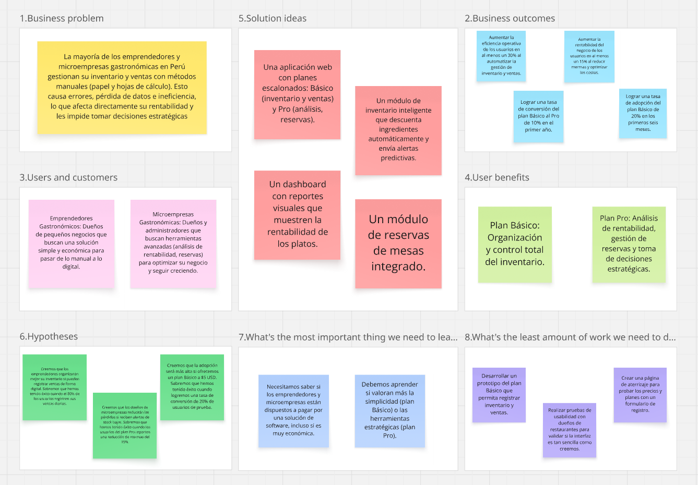
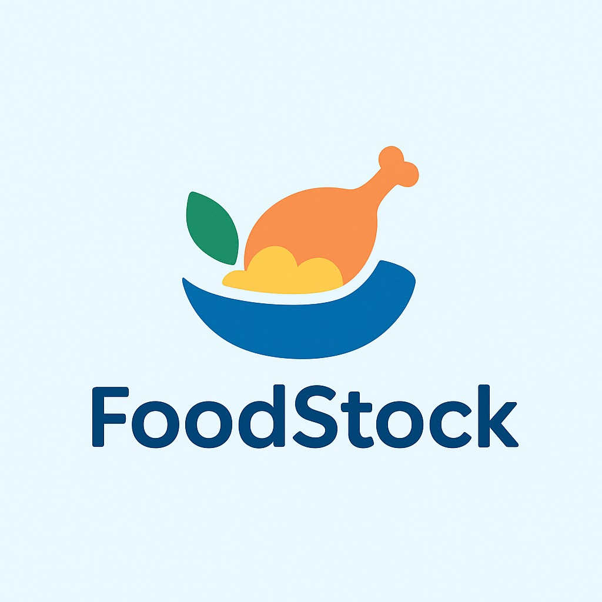
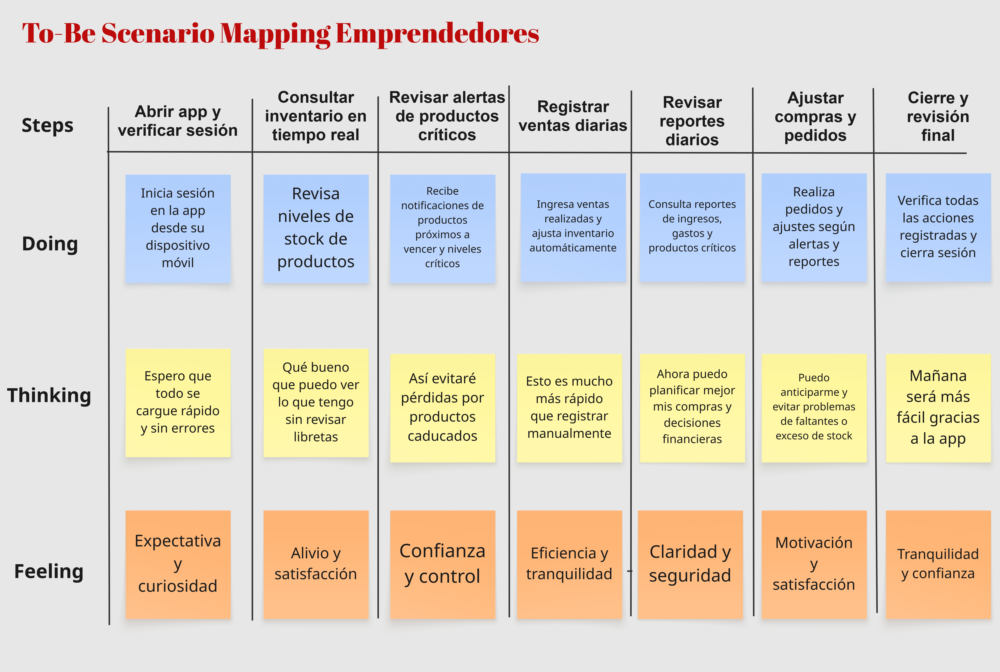
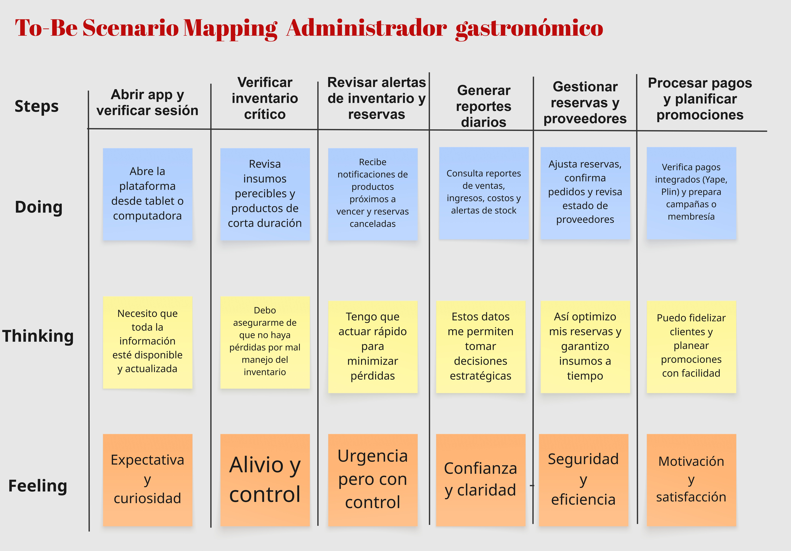
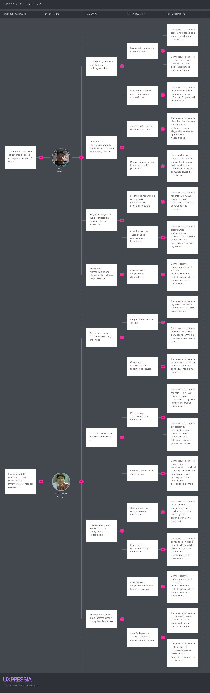

<div align ="center">

<h3>Universidad Peruana de Ciencias Aplicadas</h3>

<br>

<strong>Ingeniería de Software - 2025-2</strong><br>
<strong>1ASI0730 - Aplicaciones Web</strong><br>
<strong>NRC: 7420</strong><br>
<strong>Profesor: Alex Humberto Sánchez Ponce</strong><br>

<br><strong>Informe del Trabajo Final</strong><br><br>

<strong>Startup: GestionPro </strong><br>
<strong>Producto: FoodStock</strong><br>


### Team Members:

|             Member              |    Code    |
|:-------------------------------:|:----------:|
|  José María Franco Del Carpio   |   U202319178   |
|   Jean Pool Huaman De La Cruz   |    U20201E781  |
|  Javier Masaru Nikaido Vargas   |    U20221G099  |
| Quintanilla Pozo Gonzalo Samuel | u202315007 |
|  Melina Liz Santillan Alvarado  | U202216058 |

<strong> Setiembre 2025</strong><br>
</div>

# Registro de Versiones del Informe
<table>
  <tr>
    <th>Versión</th>
    <th>Fecha</th>
    <th>Autor</th>
    <th>Descripción de modificación</th>
  </tr>
  <tr>
    <td>TB1</td>
    <td>2025-09-20</td>
    <td>
      <ul> 
        <li>José María Franco Del Carpio</li> 
        <li>Jean Pool Huaman De La Cruz</li> 
        <li>Javier Masaru Nikaido Vargas</li>
        <li>Quintanilla Pozo Gonzalo Samuel</li>
        <li>Melina Liz Santillan Alvarado</li>
      </ul>
    </td>
    <td> Se han incluído los siguientes capítulos:
        <ul>
          <li>Capítulo I: Introducción</li>
          <li>Capítulo II: Requirements Elicitation & Analysis</li>
          <li>Capítulo III: Requirements Specification</li>
          <li>Capítulo IV: Product Design</li>
          <li>Avance del Capítulo V: Product Implementation, Validation & Deployment hasta el punto 5.2.1.8</li>
          <li>Avance de Conclusiones, Bibliografía y Anexos</li>
        </ul>
    </td>
  </tr>
</table>


# Project Report Collaboration Insights


# Contenido

## Tabla de contenidos
- [Student Outcome](#student-outcome)
- [Capítulo I: Introducción](#capítulo-i-introducción)
    - [1.1. Startup Profile](#11-startup-profile)
        - [1.1.1. Descripción de la Startup](#111-descripción-de-la-startup)
        - [1.1.2. Perfiles de integrantes del equipo](#112-perfiles-de-integrantes-del-equipo)
    - [1.2. Solution Profile](#12-solution-profile)
        - [1.2.1. Antecedentes y problemática](#121-antecedentes-y-problemática)
        - [1.2.2. Lean UX Process](#122-lean-ux-process)
            - [1.2.2.1. Lean UX Problem Statements](#1221-lean-ux-problem-statements)
            - [1.2.2.2. Lean UX Assumptions](#1222-lean-ux-assumptions)
            - [1.2.2.3. Lean UX Hypothesis Statements](#1223-lean-ux-hypothesis-statements)
            - [1.2.2.4. Lean UX Canvas](#1224-lean-ux-canvas)
    - [1.3. Segmentos objetivo](#13-segmentos-objetivo)
- [Capítulo II: Requirements Elicitation & Analysis](#capítulo-ii-requirements-elicitation--analysis)
    - [2.1. Competidores](#21-competidores)
        - [2.1.1. Análisis competitivo](#211-análisis-competitivo)
        - [2.1.2. Estrategias y tácticas frente a competidores](#212-estrategias-y-tácticas-frente-a-competidores)
    - [2.2. Entrevistas](#22-entrevistas)
        - [2.2.1. Diseño de entrevistas](#221-diseño-de-entrevistas)
        - [2.2.2. Registro de entrevistas](#222-registro-de-entrevistas)
        - [2.2.3. Análisis de entrevistas](#223-análisis-de-entrevistas)
    - [2.3. Needfinding](#23-needfinding)
        - [2.3.1. User Personas](#231-user-personas)
        - [2.3.2. User Task Matrix](#232-user-task-matrix)
        - [2.3.3. User Journey Mapping](#233-user-journey-mapping)
        - [2.3.4. Empathy Mapping](#234-empathy-mapping)
    - [2.4. Big Picture EventStorming](#24-big-picture-eventstorming)
    - [2.5. Ubiquitous Language](#25-ubiquitous-language)
- [Capítulo III: Requirements Specification](#capítulo-iii-requirements-specification)
    - [3.1. To-Be Scenario Mapping](#31-to-be-scenario-mapping)
    - [3.2. User Stories](#32-user-stories)
    - [3.3. Impact Mapping](#33-impact-mapping)
    - [3.4. Product Backlog](#34-product-backlog)
- [Capítulo IV: Product Design](#capítulo-iv-product-design)
    - [4.1. Style Guidelines](#41-style-guidelines)
        - [4.1.1. General Style Guidelines](#411-general-style-guidelines)
        - [4.1.2. Web Style Guidelines](#412-web-style-guidelines)
    - [4.2. Information Architecture](#42-information-architecture)
        - [4.2.1. Organization Systems](#421-organization-systems)
        - [4.2.2. Labeling Systems](#422-labeling-systems)
        - [4.2.3. SEO Tags and Meta Tags](#423-seo-tags-and-meta-tags)
        - [4.2.4. Searching Systems](#424-searching-systems)
        - [4.2.5. Navigation Systems](#425-navigation-systems)
    - [4.3. Landing Page UI Design](#43-landing-page-ui-design)
        - [4.3.1. Landing Page Wireframe](#431-landing-page-wireframe)
        - [4.3.2. Landing Page Mock-up](#432-landing-page-mock-up)
    - [4.4. Web Applications UX/UI Design](#44-web-applications-uxui-design)
        - [4.4.1. Web Applications Wireframes](#441-web-applications-wireframes)
        - [4.4.2. Web Applications Wireflow Diagrams](#442-web-applications-wireflow-diagrams)
        - [4.4.2. Web Applications Mock-ups](#442-web-applications-mock-ups)
        - [4.4.3. Web Applications User Flow Diagrams](#443-web-applications-user-flow-diagrams)
    - [4.5. Web Applications Prototyping](#45-web-applications-prototyping)
    - [4.6. Domain-Driven Software Architecture](#46-domain-driven-software-architecture)
        - [4.6.1. Software Architecture Context Diagram](#461-software-architecture-context-diagram)
        - [4.6.2. Software Architecture Container Diagrams](#462-software-architecture-container-diagrams)
        - [4.6.3. Software Architecture Components Diagrams](#463-software-architecture-components-diagrams)
    - [4.7. Software Object-Oriented Design](#47-software-object-oriented-design)
        - [4.7.1. Class Diagrams](#471-class-diagrams)
    - [4.8. Database Design](#48-database-design)
        - [4.8.1. Database Diagrams](#481-database-diagrams)
- [Capítulo V: Product Implementation, Validation & Deployment](#capítulo-v-product-implementation-validation--deployment)
    - [5.1. Software Configuration Management](#51-software-configuration-management)
        - [5.1.1. Software Development Environment Configuration](#511-software-development-environment-configuration)
        - [5.1.2. Source Code Management](#512-source-code-management)
        - [5.1.3. Source Code Style Guide & Conventions](#513-source-code-style-guide--conventions)
        - [5.1.4. Software Deployment Configuration](#514-software-deployment-configuration)
    - [5.2. Landing Page, Services & Applications Implementation](#52-landing-page-services--applications-implementation)
        - [5.2.1. Sprint 1](#521-sprint-1)
            - [5.2.1.1. Sprint Planning 1](#5211-sprint-planning-1)
            - [5.2.1.2. Aspect Leaders and Collaborators](#5212-aspect-leaders-and-collaborators)
            - [5.2.1.3. Sprint Backlog 1](#5213-sprint-backlog-1)
            - [5.2.1.4. Development Evidence for Sprint Review](#5214-development-evidence-for-sprint-review)
            - [5.2.1.5. Execution Evidence for Sprint Review](#5215-execution-evidence-for-sprint-review)
            - [5.2.1.6. Services Documentation Evidence for Sprint Review](#5216-services-documentation-evidence-for-sprint-review)
            - [5.2.1.7. Software Deployment Evidence for Sprint Review](#5217-software-deployment-evidence-for-sprint-review)
            - [5.2.1.8. Team Collaboration Insights during Sprint](#5218-team-collaboration-insights-during-sprint)
    - [5.3. Validation Interviews](#53-validation-interviews)
      - [5.3.1. Diseño de Entrevistas](#531-diseño-de-entrevistas)
      - [5.3.2. Registro de Entrevistas](#532-registro-de-entrevistas)
      - [5.3.3. Evaluaciones según heurísticas](#533-evaluaciones-según-heurísticas)
    - [5.4. Video About-the-Product](#54-video-about-the-product)
- [Conclusiones](#conclusiones)
- [Conclusiones y recomendaciones](#conclusiones-y-recomendaciones)
- [Video About-the-Team](#video-about-the-team)
- [Bibliografía](#bibliografía)
- [Anexos](#anexos)

---

## Student Outcome
**ABET – EAC - Student Outcome 5**  
**Criterio:** La capacidad de funcionar efectivamente en un equipo cuyos miembros juntos proporcionan liderazgo, crean un entorno de colaboración e inclusivo, establecen objetivos, planifican tareas y cumplen objetivos.  

En el siguiente cuadro se describe las acciones realizadas y enunciados de conclusiones por parte del grupo, que permiten sustentar el haber alcanzado el logro del ABET – EAC - Student Outcome 5.  

<div>
<table>
  <thead>
    <tr>
      <th>Criterio específico</th>
      <th>Nombre</th>
      <th>Acciones realizadas</th>
      <th>Conclusiones</th>
    </tr>
  </thead>
  <tbody>
    <!-- Criterio 1 -->
    <tr>
      <td rowspan="5">Trabaja en equipo para proporcionar liderazgo en forma conjunta</td>
      <td>Gonzalo Samuel Quintanilla Pozo</td>
      <td>
        TB1: Realizó la mayor parte del Capítulo 4: Information Architecture, Landing Page UI Design, Web Applications UX/UI Design, Prototyping y Domain-Driven Software Architecture. También aportó en User Stories, análisis de competidores y Lean UX Process (Problem Statements, Assumptions, Hypothesis Statements, Lean UX Canvas).
        <br>
        TP:<br>
        TB2:<br>
        TF:
      </td>
      <td rowspan="5">El equipo demostró liderazgo conjunto mediante la organización, coordinación y desarrollo de tareas clave, asegurando que cada miembro contribuyera de manera estratégica al proyecto.</td>
    </tr>
    <tr>
      <td>Melina Liz Santillan Alvarado</td>
      <td>
        TB1: Diseñó wireframes, mock-ups, diagramas de base de datos y de clases, style guidelines, segmentación de objetivos y diseño de entrevistas, además de aportar en User Stories.
        <br>
        TP:<br>
        TB2:<br>
        TF:
      </td>
    </tr>
    <tr>
      <td>Javier Masaru Nikaido Vargas</td>
      <td>
        TB1: Aportó en Capítulo II: Requirements Elicitation & Analysis, análisis de competidores, User Stories, Wireframes, Wireflow Diagrams, Mock-ups y User Flow Diagrams, Web Applications Prototyping y Domain-Driven Software Architecture.
        <br>
        TP:<br>
        TB2:<br>
        TF:
      </td>
    </tr>
    <tr>
      <td>Jean Pool Huaman De La Cruz</td>
      <td>
        TB1: Elaboró antecedentes y problemática, To-Be Scenario Mapping, Lean UX Process, definición de segmentos objetivo, Impact Mapping y Product Backlog.
        <br>
        TP:<br>
        TB2:<br>
        TF:
      </td>
    </tr>
    <tr>
      <td>José María Franco Del Carpio</td>
      <td>
        TB1: Aportó ideas puntuales en User Stories y en entrevistas iniciales.
        <br>
        TP:<br>
        TB2:<br>
        TF:
      </td>
    </tr>
    <!-- Criterio 2 -->
    <tr>
      <td rowspan="5">Crea un entorno colaborativo e inclusivo, establece metas, planifica tareas y cumple objetivos.</td>
      <td>Gonzalo Samuel Quintanilla Pozo</td>
      <td>
        TB1: Coordinó tareas del capítulo 4, revisó prototipos de la landing page, definió etiquetas SEO y sistemas de navegación, y apoyó en User Stories.
        <br>
        TP:<br>
        TB2:<br>
        TF:
      </td>
      <td rowspan="5">El equipo fomentó un entorno colaborativo e inclusivo mediante la distribución de tareas, coordinación entre miembros y planificación de actividades para cumplir los objetivos del proyecto.
        </td>
    </tr>
    <tr>
      <td>Melina Liz Santillan Alvarado</td>
      <td>
        TB1: Diseñó wireframes y mock-ups, elaboró diagramas de base de datos y de clases, definió style guidelines, segmentación de objetivos y diseñó entrevistas.
        <br>
        TP:<br>
        TB2:<br>
        TF:
      </td>
    </tr>
    <tr>
      <td>Javier Masaru Nikaido Vargas</td>
      <td>
        TB1: Realizó análisis de competidores, elaboró User Stories, Wireframes, Wireflow Diagrams y Mock-ups, y participó en prototipado y arquitectura orientada a dominios.
        <br>
        TP:<br>
        TB2:<br>
        TF:
      </td>
    </tr>
    <tr>
      <td>Jean Pool Huaman De La Cruz</td>
      <td>
        TB1: Elaboró antecedentes y problemática, definió To-Be Scenario Mapping, segmentación de objetivos, Impact Mapping y Product Backlog.
        <br>
        TP:<br>
        TB2:<br>
        TF:
      </td>
    </tr>
    <tr>
      <td>José María Franco Del Carpio</td>
      <td>
        TB1: Aportó ideas puntuales en User Stories y en entrevistas iniciales.
        <br>
        TP:<br>
        TB2:<br>
        TF:
      </td>
    </tr>
  </tbody>
</table>
</div>


## Capítulo I: Introducción
### 1.1. Startup Profile
#### 1.1.1. Descripción de la Startup
En GestionPro, ofrecemos soluciones tecnológicas orientadas a optimizar las áreas operativas y comerciales de los restaurantes, con la finalidad de simplificar su organización interna y potenciar su rendimiento. Nuestra aplicación web está diseñada para convertirse en un soporte estratégico para administradores y dueños, facilitando el control de pedidos, la administración de reservas, el monitoreo de ventas y la generación de reportes en tiempo real. De esta manera, buscamos contribuir a que los restaurantes sean más eficientes en sus procesos y brinden una mejor experiencia a sus clientes.

#### -Misión:
Impulsar el desarrollo de una plataforma web que permita a los restaurantes perfeccionar la calidad de su servicio, gestionar de forma práctica sus operaciones y fortalecer el área comercial, a través de herramientas digitales accesibles, adaptables y fáciles de implementar.


#### -Visión:
Convertirnos en una startup referente en el Perú en la creación de aplicaciones web dirigidas al sector gastronómico, distinguiéndonos por la innovación constante, la personalización de nuestras soluciones y el aporte significativo a la digitalización de los restaurantes.

#### 1.1.2. Perfiles de integrantes del equipo
| Estudiante                                                                                                                 | Descripción                                                                                                                                                                                                                                                | Conocimientos                                                                                   |
|----------------------------------------------------------------------------------------------------------------------------|------------------------------------------------------------------------------------------------------------------------------------------------------------------------------------------------------------------------------------------------------------|-------------------------------------------------------------------------------------------------|
|  <br> Melina Liz Santillan Alvarado <br> U202216058                                                                | Soy estudiante de la carrera de Ingeniería de Software en la UPC y tengo 21 años. Me desempeño bien en los trabajos en equipo, además, soy responsable.                                                                                                                                                                          | Tengo conocimientos en diferentes lenguajes de programación como c#, c++ entre otros.                                                                          |
|  <br> Javier Masaru Nikaido Vargas <br> U20221G099 | Estudiante de Ingenieria de Software de 5to ciclo de la Universidad Peruana de Ciencias. Me gusta hacer las cosas con tiempo y ordenadamente, trabajar con tranquilidad y terminar mis deberes a tiempo.| conocimientos en C++, java, python.  |
| <br> José María Franco del Carpio <br> U202319178                                                                                  | Soy estudiante de la carrera de Ingeniería de Software en la Universidad Peruana de Ciencias (UPC) y tengo 20 años. Me interesa mucho lo que es la programación aunque aun soy muy verde en eso.                                                                                                                                                                                                                                                | tengo conocimientos en gamemaker, c++.                                                                                   |
|  <br> Gonzalo Samuel Quintanilla Pozo <br> U202315007                                                                | Soy estudiante de la carrera de Ingenieria de Software en la UPC y tengo 20 años, como compañero me gusta apoyar y tomar iniciativa en trabajos grupales | Me especializo en los lenguajes CSS, Java y Pyhton. Tengo experiencia desarrolando  paginas web |
|  <br> Jean Pool Huaman De La Cruz <br> U20201E781                                                                                 | Soy estudiante de la carrera de Ingenieria de Software en la UPC y Tengo 22 años. A lo largo de mi formación me he destacado por mi compromiso con el aprendizaje constante, siempre buscando reforzar mis conocimientos y mejorar en las áreas que lo requieren.                                                                                                                                                                 | Conocimientos en Python, C++ y otros lenguajes de programación.    | 
### 1.2. Solution Profile
#### 1.2.1. Antecedentes y problemática
 
En la actualidad, una gran parte de los restaurantes y negocios de comida aún gestionan su inventario y ventas mediante métodos manuales o sistemas poco eficientes. Esta situación provoca errores, pérdida de datos y demoras en la toma de decisiones. Además, la falta de control impacta negativamente en la rentabilidad, genera problemas en la disponibilidad de insumos y afecta la calidad del servicio al cliente.  

#### 5W + 2H FoodStock  

##### WHAT (QUÉ)  
- **¿Cuál es el problema?**  
El problema surge de los métodos manuales e ineficientes que muchos restaurantes y negocios de comida emplean para registrar inventario y ventas. Los encargados deben desplazarse al almacén para verificar cantidades, revisar manualmente las ventas del mes o copiar datos en distintos soportes, lo que ocasiona duplicidad, errores y desactualización de la información. Este sistema también limita el análisis estadístico y la toma de decisiones estratégicas.  

- **¿Qué consecuencias tiene?**  
La falta de control ocasiona pérdidas de ventas, retrasos en la atención, desabastecimiento de productos y fallas en la gestión administrativa, lo que afecta la rentabilidad del negocio y la satisfacción de los clientes.  

##### WHEN (CUÁNDO)  
- **¿Cuándo sucede el problema?**  
Cada vez que los dueños o administradores requieren consultar inventarios, ventas o reportes de manera remota y no cuentan con un sistema centralizado. También cuando se necesitan análisis rápidos de estadísticas o información de clientes en fechas específicas.  

- **¿Cuándo utiliza el cliente el producto?**  
El sistema se emplea a diario: para registrar ventas, actualizar inventarios, generar reportes estadísticos y consultar información en cualquier momento, optimizando la productividad y la agilidad del negocio.  


##### WHERE (DÓNDE)  
- **¿Dónde se presenta el problema?**  
En restaurantes y negocios de comida que aún dependen de registros físicos, hojas de cálculo o software limitados sin acceso flexible y en tiempo real.  

- **¿Dónde se usa el producto?**  
FoodStock se utiliza en cualquier dispositivo con conexión a internet (computadora, laptop, tablet o celular), lo que permite consultar y actualizar información desde el local, la oficina, el hogar o incluso en movimiento.  


##### WHO (QUIÉN)  
- **¿Quién tiene este problema?**  
Los negocios de comida y restaurantes que manejan inventarios físicos y requieren un sistema más ágil y confiable para gestionar sus procesos.  

- **¿Quién se beneficia del producto?**  
Dueños, administradores y empleados al contar con una herramienta centralizada y práctica; y los clientes, quienes reciben un servicio más rápido, organizado y confiable.  


##### WHY (POR QUÉ)  
- **¿Por qué ocurre el problema?**  
Porque muchos negocios aún no han adoptado herramientas digitales modernas y siguen usando métodos tradicionales que generan errores, falta de control y pérdida de oportunidades de crecimiento.  

- **¿Por qué es importante automatizar?**  
Porque la digitalización asegura un seguimiento en tiempo real del inventario, evita pérdidas de información, reduce costos y mejora la toma de decisiones. Como menciona *Castagnino*, fundador de Restaurant.pe, los restaurantes que no aprovechan las ventajas de la tecnología corren el riesgo de quedarse atrás. La transformación digital no solo permite mejorar la operativa interna, sino también otorga una ventaja competitiva al ofrecer un servicio más ágil, personalizado y adaptado a las nuevas exigencias de los consumidores.  


##### HOW (CÓMO)  
- **¿Cómo soluciona el producto el problema?**  
FoodStock centraliza la gestión de inventario y ventas en una aplicación web accesible desde cualquier dispositivo. Permite registrar operaciones de forma rápida, generar reportes estadísticos en tiempo real y ofrecer catálogos digitales a los clientes.  
En este sentido, *Castagnino* señala que la transformación digital es la clave del cambio en la industria gastronómica, pues permite operaciones más ágiles, fidelización de clientes y decisiones estratégicas basadas en indicadores como *food cost*, mermas y rotación de insumos. 


##### HOW MUCH (CUÁNTO)  
- **¿Cuánto mejora el producto la situación actual?**  
FoodStock reduce de manera considerable el tiempo invertido en tareas manuales, minimiza errores, evita duplicidad de información y facilita la planificación del negocio con datos confiables.  

- **¿Qué beneficios se obtienen al digitalizar y automatizar?**  
Mayor eficiencia operativa, reducción de costos, mejor trazabilidad del inventario, control de stock más preciso,  atención al cliente más ágil y profesional.


#### 1.2.2. Lean UX Process
##### 1.2.2.1. Lean UX Problem Statements

En el sector gastronomico actual, muchos restaurantes y negocios de comida operan con sistemas de inventario y ventas manuales o ineficientes. Esto lleva a cabo que estos tengan una necesidad critica de implementar una solución integral que automatice estos procesos, sea accesible desde cualquier dispositivo y brinde información en tiempo real. Esta herramienta debe permitir a 
los propietarios y administradores visualizar el inventario, registrar entradas y salidas de productos, y monitorear las ventas de manera eficiente para optimizar la operación y mejorar la toma de decisiones estratégicas.

En la actualidad, estos negocios suelen gestionar su stock y ventas con metodos tradicionales, como hojas de cálculo, registros en cuadernos o software muy limitados y presentan serias dificultades como la duplicacion de datos, perdidas de informacion, la falta de actualizaciones, el tiempo valioso buscando datos especificos y generado reportes de manera manual, tambien la 
ausencia de acceso remoto al sistema de invetario que impedira la supervisión del negocio desde multiples ubicaciones.

Para abordar esta problemática, nos haremos las siguientes preguntas con que nos guiaremos para el desarrolo de **FoodStock**:

¿Cómo se puede digitalizar el inventario de un restaurante? ¿De qué manera podemos evitar el desperdicio de alimentos? ¿Comó se puede registrar las ventas en tiempo real? ¿De qué forma se puede mejorar la toma de pedidos en un restaurante? 
¿Cómo se puede monitorear el negocio desde cualquier lugar? ¿Cómo pueden los clientes ver el menu y los precios en linea? ¿Comó se registra la entrada y salida de producots de forma rapida y sin errores?
#### 1.2.2.2. Lean UX Assumptions

#### Business Assumptions

1. **Creo que mis clientes necesitan** una solución para organizar y profesionalizar la gestion de sus negocios, pero que esta solución debe ser escalable para crecer con ellos.
2. **Estas necesidades se pueden resolver con** una aplicación web que integre gestion de inventario, ventas, reportes y reservas de mesas y que se ofrezca en dos planes: Un Basico
para ordenar y un Pro para optimizar y crecer.
3. **Mis clientes iniciales serán** emprendedores y microempresas gastronómicas interesados en digitalizar sus procesos parar mejorar eficiencia y la rentabilidad.
4. **El valor más importante que el cliente busca de mi servicios es** una herramienta que les ahorre tiempo y les pueda ayudar a tomar decisiones inteligentes para
aumentar sus ganancias.
5. **El cliente tambien puede obtener estos benficios adicionales:** en el plan Básico, organizacion simple y un inventario que se descuenta automáticamente; en el plan Pro,
análisis de rentabilidad, alertas de stock predictivas y un sistema de reservas de mesas.
6. **Voy a adquirir la mayoria de mis clientes a través de** marketing digital en redes sociales y alianzas con asociaciones gastronómicas.
7. **Haré dinero a través de** un modulo de suscripción mensual con dos planes: El basico (5 USD) y el Plan Pro (25 USD).
8. **Mi competencia principal en el mercado será** otras aplicaciones de gestion de restaurantes y sistemas de puntos de venta que ofrecen soluciones de inventario.
9. **Los venceremos debido a** un enfoque centrado en la simplicidad, un modelo de planes flexible y un claro énfasis en la rentabilidad del cliente, ofreciendo las herramientas que realmente necesitan para crecer.
10. **Mi mayor riesgo de productos es que** los clientes del plan Básico no vean suficiente valor para pasar al plan Pro.
11. **Resolveremos esto a traves de** pruebas gratuitas de las funciones Pro y tutoriales que muestren el valor añadido y el retorno de inversión.

#### User Assumptions
#### ¿Quién es el usuario?
Los usuarios de FoodStock son dueños de negocios y administradores de restaurantes, que buscan una herramienta para organizar y optimizar la gestión de su negocio.
#### ¿Qué problemas tiene nuestro producto que resolver?
FoodStock busca resolver la desorganización en el registro de inventario y ventas, los errores manuales y falta de datos claves que impiden a los dueños de restaurantes tomar decisiones estratégicas.
#### ¿Qué caracteristicas son importantes?
Las características clave son la simplicidad y la confiabilidad. Los usuarios necesitan una interfaz intuitiva para registrar inventario y ventas.
Es crucial que el sistema incluya el descuento automático de ingredientes por cada plato vendido, asi como la capacidad de generar reportes.
#### ¿Dónde encaja nuestro producto en su trabajo o vida?
El producto se convierte en una herramienta central que reemplaza los múltiples sistemas desorganizados. Se integra en la rutina diaria de los usuarios
para facilitar la gestion del negocio.
#### ¿Cuándo y cómo nuestro producto es usudo?
El producto se utiliza diariamente para registrar operaciones y semanalmente o mensualmente para análisis estratégicos y toma de decisiones. Su uso es
a través de una aplicación web accesible desde navegadores de cualquier dispositivo, lo que permitira a los usuarios gestionar su negocio de cualquier lugar
con conexión a internet.
#### ¿Cómo debe verse nuestro producto y cómo comportarse?
El producto debe tener un diseño visual simple y claro, con iconos intuitivos y un lenguaje accesible que permita a los usuarios aprender a usarlo rápidamente. Además, debe comportarse de forma ágil,
confiable y proactiva, garantizando que los datos estén siempre actualizados y que la experiencia del usuario sea fluida, enviando notificaciones para alertar sobre eventos importantes como el bajo nivel de stock.

#### 1.2.2.3. Lean UX Hypothesis Statements
#### Hypothesis 01:
**Creemos que** los emprendedores gastronómicos organizarán mejor su inventario si pueden registrar sus ventas de forma digital y ver cómo el stock se actualiza automáticamente.

**Sabremos que** hemos tenido éxito.

**Cuando** los usuarios del plan Básico registren al menos el 80% de sus ventas diarias en la plataforma.

#### Hypothesis 02:
**Creemos que** los dueños de microempresas reducirán las pérdidas de stock y mejorarán la eficiencia de sus compras si reciben alertas inteligentes sobre los niveles bajos de inventario.

**Sabremos que** hemos tenido éxito.

**Cuando** los usuarios del plan Pro reporten una reducción de mermas del 15% y utilicen la función de alertas al menos una vez a la semana.

#### Hypothesis 03:
**Creemos que** los dueños de restaurantes tomarán decisiones más inteligentes sobre su menú si tienen acceso a reportes que les muestren la rentabilidad de cada plato.

**Sabremos que** hemos tenido éxito.

**Cuando** el 60% de los usuarios del plan Pro utilicen el dashboard de rentabilidad y reporten que ajustaron precios o promociones basándose en la información de la plataforma.

#### Hypothesis 04:
**Creemos que** los administradores de restaurantes mejorarán la organización de su local si cuentan con un sistema de reservas de mesas integrado en la plataforma.

**Sabremos que** hemos tenido éxito.

**Cuando** los usuarios del plan Pro reciban y gestionen al menos 30 reservas al mes a través de la plataforma.

#### Hypothesis 05:
**Creemos que** la adopción del sistema será más alta si ofrecemos un plan Básico con funciones esenciales a un precio muy accesible.

**Sabremos que** hemos tenido éxito.

**Cuando** logremos una tasa de conversión del 20% de usuarios que prueben el plan Básico y se conviertan en suscriptores de pago.

#### 1.2.2.4. Lean UX Canvas
**Figura 1. Lean UX Canvas de FoodStock**

**Enlace al Lean UX Canvas:** [*Ver en Miro*](https://miro.com/welcomeonboard/Y3IzVElSYUZ5bE9rS0xpeE03bzRXUWhESVhFMUE0Rlhyb3lVVlBvS3lLZnBYK1Q5SVZWbnRJaEd5OW1QdFcvRjJWSUVRaEVLNVVxQnJwV3E1bWdQS0lhMFUwdXIwNThuaWpBa3F4dzlXUkljOTlmZllVZEZpR0d3Z1VPU1ZDMTF3VHhHVHd5UWtSM1BidUtUYmxycDRnPT0hdjE=?share_link_id=680165327739)
### 1.3. Segmentos objetivo
El primer usuario objetivo es un dueño de un emprendimiento gastronómico, residente de Lima Metropolitana y con una experiencia básica en la gestión de negocios. Sus intereses principales en la gestión de inventario y administración de ventas.

El segundo usuario objetivo es un administrador de una microempresa gastronómica, ubicada en Lima Metropolitana. Busca soluciones para mejor el control del inventario y administración de las ventas totales, además, desea aumentar la rentabilidad de la microempresa.

## Capítulo II: Requirements Elicitation & Analysis
### 2.1. Competidores
#### 2.1.1. Análisis competitivo
El análisis competitivo tiene como objetivo principal identificar las características de los competidores, evaluar sus fortalezas y debilidades, y encontrar maneras de diferenciarnos para 
obtener una ventaja competitiva.

<table>
  <thead>
    <tr>
      <th colspan="7"><b>Competitive Analysis Landscape</b></th>
    </tr>
  </thead>
  <tbody>
    <tr>
      <td colspan="2" align="center">¿Por qué llevar a cabo este análisis?</td>
      <td colspan="5" align="center">El objetivo de este análisis es identificar las características de los competidores, evaluar sus fortalezas y debilidades, y encontrar maneras de diferenciarnos para obtener una ventaja competitiva.</td>
    </tr>
      <tr>
    <td colspan="2" rowspan="2" valign="top">Startup y Competidores</td>
        <td valign="top" align="center">FoodStock</td>
        <td valign="top" align="center">SICO RESTAURANTES</td>
        <td valign="top" align="center">Xtrachef </td>
        <td valign="top" align="center">Panca</td>
  </tr>
  <tr>
    <td valign="top" align="center"></td>
    <td valign="top" align="center"></td>
    <td valign="top" align="center"></td>
    <td valign="top" align="center"></td>
   </tr>
  <tr>
    <td rowspan="2" valign="top">Perfil</td>
    <td valign="top">Overview</td>
    <td valign="top">FoodStock es una aplicación web orientada a optimizar la gestión de inventario y ventas en el sector gastronómico. Permite a los dueños y administradores registrar, supervisar y analizar sus operaciones, fortaleciendo la calidad del servicio y la rentabilidad.</td>
    <td valign="top">SICO RESTAURANTES es un software de gestión para restaurantes que se enfoca en el control del día a día, incluyendo inventario en línea, manejo de recetas, facturación electrónica y gestión de comandas táctiles.</td>
    <td valign="top">Xtrachef es una herramienta de gestión de inventario y costos diseñada específicamente para el sector gastronómico. Su enfoque principal es el control de recetas, insumos y mermas para optimizar la rentabilidad del negocio.</td>
    <td valign="top">Panca es un sistema de gestión para restaurantes que integra múltiples funcionalidades, como el punto de venta (POS), inventario y un sistema para gestionar pedidos y delivery.</td>
  </tr>
  <tr>
    <td valign="top">Ventaja competitiva ¿Qué valor ofrece a los clientes?</td>
    <td valign="top">FoodStock se diferencia por ofrecer una solución que es accesible, fácil de usar y escalable. Proporcionamos una herramienta que no solo organiza, sino que también ayuda a los clientes a aumentar su rentabilidad con análisis clave, ideal para emprendedores y microempresas.</td>
    <td valign="top">Su valor principal es la automatización y la integración de procesos clave, como comandas táctiles y facturación electrónica, en un solo sistema fácil de usar para restaurantes establecidos y de diversos tipos.</td>
    <td valign="top">Ofrecen una solución altamente especializada en el control de costos y rentabilidad por plato, lo que lo hace muy atractivo para chefs y gerentes de costos.</td>
    <td valign="top">Su ventaja radica en ser una solución todo-en-uno que cubre la mayoría de las necesidades operativas de un restaurante, desde el inventario hasta la gestión del salón y el delivery.</td>
  </tr>
  <tr>
    <td rowspan="2" valign="top">Perfil de Marketing</td>
    <td valign="top">Mercado objetivo</td>
    <td valign="top">Emprendedores gastronómicos y dueños de pequeños negocios de comida que buscan una solución simple y económica para digitalizar su gestión.</td>
    <td valign="top">Restaurantes, restobares, cafés y casinos de comida ya establecidos que buscan un control integral de sus operaciones.</td>
    <td valign="top">Gerentes de costos y chefs que buscan una herramienta especializada en la optimización de la rentabilidad del menú, el control de recetas y la gestión de mermas.</td>
    <td valign="top">Dueños y administradores de restaurantes que necesitan una solución todo-en-uno que integre POS, inventario, delivery y un sistema de gestión completo.</td>
  </tr>
  <tr>
    <td valign="top">Estrategias de marketing</td>
    <td valign="top">Publicidad en redes sociales (Facebook, Instagram) con un enfoque en la simplicidad y el ahorro de tiempo</td>
    <td valign="top">Demo y prueba gratuita: Ofrecen una prueba gratuita de 30 días para que los clientes puedan evaluar la funcionalidad del software.</td>
    <td valign="top">Publicidad en plataformas especializadas, eventos del sector y colaboraciones con organizaciones que promueven la innovación en la agricultura.</td>
    <td valign="top">Ventas consultivas, demostraciones del producto a equipos gerenciales y campañas de marketing de contenidos que demuestran la funcionalidad de su Sistema.</td>
  </tr>
  <tr>
    <td rowspan="3" valign="top">Perfil de Producto</td>
    <td valign="top">Productos & Servicios</td>
    <td valign="top">Módulo de gestión de inventario, registro de ventas y para el otro plan seria módulo de análisis de rentabilidad, sistema de reservas, reportes avanzados.</td>
    <td valign="top">Módulos de inventario y stock, manejo de recetas, comandas táctiles, facturación electrónica y reportes de ventas.</td>
    <td valign="top">Control de recetas, mermas, y precios de menú.</td>
    <td valign="top">POS, inventario, delivery, gestión de pedidos.</td>
  </tr>
  <tr>
    <td valign="top">Precios & Costos</td>
    <td valign="top">Costo Mensual para el plan básico ($5 USD), Plan Pro ($25 USD).</td>
    <td valign="top">(No se conoce el precio mensual)</td>
    <td valign="top">(No se conoce el precio mensual)</td>
    <td valign="top">(No se conoce el precio mensual)</td>
  </tr>
  <tr>
    <td valign="top">Canales de distribución (Web y/o Móvil)</td>
    <td valign="top">Plataforma web responsiva para PC, Tablet y celular, disponible desde cualquier navegador y no requiere descargar una app para usarla.</td>
    <td valign="top">Ofrecen soluciones en la nube, pero también se pueden instalar en computadoras de escritorio.</td>
    <td valign="top">Aplicación web con un enfoque en la usabilidad móvil para el uso en la cocina.</td>
    <td valign="top">Solución en la nube accesible desde web y con aplicaciones dedicadas para dispositivos móviles.</td>
  </tr>
  <tr>
    <td rowspan="4" valign="top">Análisis SWOT</td>
    <td valign="top">Fortalezas</td>
    <td valign="top">Precios bajos para un mercado que no puede pagar soluciones más caras, interfaz intuitiva y facil de usar, ideal para emprendedores con poca conocimiento tecnologico y rentabilidad en dar herramientas claves para que los negocios crezcan.</td>
    <td valign="top">Tiene más de 25 años en la industria del software, lo que genera confianza a los clientes e integra multiples funcionalidades operativas en un solo software.</td>
    <td valign="top">Herramienta enfocada en un nicho muy especifico que hace muy valioso para gerentes.</td>
    <td valign="top">Proporcionan un ecosistema completo para el negocio, desde el POS hasta la gestión de inventario.</td>
  </tr>
  <tr>
    <td valign="top">Debilidades</td>
    <td valign="top">Al ser esta un nuevo Startup tiene un bajo notoriedad de marca. Tambien el plan basico no tiene todas las herramientas que podría tener la competencia.</td>
    <td valign="top">El precio puede ser muy alto para los pequeños negocios, ya que esta diseñado para empresas establecidas.</td>
    <td valign="top">Su especialización en costos podría no ser atractiva para negocios que buscan una solución integral.</td>
    <td valign="top">Su especialización en costos podría no ser atractiva para negocios que buscan una solución integral y sus costos son muy elevados para los negocios que recien estan empezando.</td>
  </tr>
  <tr>
    <td valign="top">Oportunidades</td>
    <td valign="top">El sector gastronómico se está digitalizando, lo que crea una alta demanda de herramientas como FoodStock y un vacío para una solución que sea económica, simple y que se enfoque en la rentabilidad de los negocios pequeños.</td>
    <td valign="top">Pueden ofrecer soluciones a otros tipos de negocios (hoteles, minimarkets) para seguir creciendo.</td>
    <td valign="top">Pueden colaborar con plataformas de POS o de inventario para complementar sus funciones.</td>
    <td valign="top">Tienen la oportunidad de seguir creciendo al ofrecer más funcionalidades a sus clientes.</td>
  </tr>
  <tr>
    <td valign="top">Amenazas</td>
    <td valign="top">Pueden surgir competidores que ofrezcan soluciones gratuitas o más baratas y algunos emprendedores prefiren seguir con sus métodos manuales tradicionales.</td>
    <td valign="top">La entrada de nuevas startups con precios más competitivos puede afectar su cuota de mercado.</td>
    <td valign="top">El surgimiento de nuevas herramientas puede volver obsoleto su modelo de control de costos.</td>
    <td valign="top">Al ser un software "todo-en-uno", la llegada de soluciones más especializadas podría afectar su posición.</td>
  </tr>
  <tr>
    <td rowspan="4" valign="top">Precios y costos</td>
    <td valign="top">Costo Anual</td>
    <td valign="top">Desde $60 USD hasta $300 USD.</td>
    <td valign="top">(No se conoce el precio anual).</td>
    <td valign="top">(No se conoce el precio anual).</td>
    <td valign="top">(No se conoce el precio anual).</td>
  </tr>
  <tr>
    <td valign="top">Mensual</td>
    <td valign="top">Plan basico de $5 y pro de $25 USD</td>
    <td valign="top">(No se conoce el precio mensual)</td>
    <td valign="top">(No se conoce el precio mensual)</td>
    <td valign="top">(No se conoce el precio mensual)</td>
  </tr>
</table>

#### 2.1.2. Estrategias y tácticas frente a competidores

Basándonos en el análisis competitivo frente a plataformas como **SICO RESTAURANTES, Xtrachef y Panca**, se proponen las siguientes estrategias y tácticas para posicionar a **FoodStock** como una solución diferenciada y adaptada al contexto de emprendedores y microempresas gastronómicas en el Perú:  

**Estrategia 1: Accesibilidad y precios competitivos**  
- Mantener planes asequibles desde **$5 USD mensuales**, destacando la relación costo-beneficio frente a sistemas más caros.  
- Ofrecer un **plan freemium de prueba** con funciones básicas y la opción de experimentar las características Pro.  
- Comunicar claramente los beneficios económicos del sistema (ahorro de tiempo, reducción de mermas, control en tiempo real).  

**Estrategia 2: Enfoque en microempresas y emprendimientos**  
- Diseñar campañas dirigidas a dueños de **pequeños restaurantes y negocios emergentes** que no pueden costear soluciones complejas.  
- Resaltar la **simplicidad de uso** de la plataforma para usuarios con poca experiencia tecnológica.  
- Presentar casos de uso reales de microempresas que hayan mejorado su rentabilidad gracias a la digitalización.  

**Estrategia 3: Diferenciación por escalabilidad funcional**  
- Ofrecer dos planes de servicio: **Básico** (inventario y ventas) y **Pro** (análisis de rentabilidad, reservas y alertas predictivas).  
- Posicionar al plan Pro como una alternativa más completa frente a sistemas especializados como Xtrachef o soluciones “todo-en-uno” como Panca.  
- Mostrar la evolución natural de crecimiento: empezar simple y luego pasar a funciones avanzadas.  

**Estrategia 4: Marketing digital de bajo costo y alto alcance**  
- Publicidad en **redes sociales (Facebook, Instagram)** con mensajes claros sobre organización, simplicidad y ahorro de tiempo.  
- Uso de **tutoriales audiovisuales y guías rápidas** para demostrar la facilidad de implementación.  
- Aprovechar **alianzas con asociaciones gastronómicas** para ganar visibilidad y confianza en el sector.  

**Estrategia 5: Experiencia de usuario intuitiva y confiable**  
- Priorizar un diseño visual simple y accesible desde cualquier dispositivo sin necesidad de instalación adicional.  
- Implementar **notificaciones inteligentes** (bajo stock, ventas destacadas, reservas pendientes).  
- Garantizar **datos actualizados en tiempo real**, fortaleciendo la confianza del usuario en la plataforma.  

**Estrategia 6: Posicionamiento como aliado estratégico de negocios pequeños**  
- Promover testimonios de usuarios que lograron reducir mermas y mejorar la gestión con FoodStock.  
- Participar en **eventos de innovación gastronómica y digitalización de pymes**.  
- Comunicar el impacto positivo en la **rentabilidad y eficiencia operativa** de los negocios que adoptan la solución.  
### 2.2. Entrevistas
#### 2.2.1. Diseño de entrevistas
#### Emprendedores
1. ¿Cómo gestionas normalmente tu inventario y tus ventas?
2. ¿Qué dificultades tienes en el control de stock en tu inventario?
3. ¿Cuánto tiempo requieres para registrar todo tu inventario?
4. ¿Qué problemas tienes con los alimentos de corta duración?
5. ¿Qué opinas sobre una aplicación web que te permita gestionar tu inventario y tus ventas?
6. ¿Qué otras funcionalidades desearías que tenga la aplicación web?
7. ¿Qué información desearías que tenga un reporte de ventas?
8. ¿Estarías dispuesto a pagar una membresía mensual para acceder a una aplicación web que te ayude en tu área de operaciones y comercial? ¿Por qué?
9. ¿Qué beneficios crees que podría tener tu emprendimiento si accedieras a esta aplicación web?

#### Microempresas
1. ¿Cómo gestionas normalmente tu inventario y tus ventas?
2. ¿Qué dificultades tienes en las reservas de mesas?
3. ¿Qué herramienta utilizas para hacer el registro de una reserva de mesa?
4. ¿Cuánto tiempo requieres para registrar todo tu inventario?
5. ¿Qué dificultades tienes en el control de stock en tu inventario?
6. ¿Qué opinas sobre una aplicación web que te permita gestionar tu inventario y tus ventas?
7. ¿Qué otras funcionalidades desearías que tenga la aplicación web?
8. ¿Qué información desearías que tenga un reporte de ventas?
9. ¿Qué problemas tienes con los alimentos de corta duración?
10. ¿Estarías dispuesto a pagar una membresía mensual para acceder a una aplicación web que te ayude en tu área de operaciones y comercial? ¿Por qué?

#### 2.2.2. Registro de entrevistas

___

#### Segmento Emprendedor:

Entrevista 1:

| Nombre                | Adriano Samuel Alzamora Carrillo                                                                                                                                                                                                                                                                                                                                                                                                                                                                                                                                                                                                                                                                                               |
|-----------------------|--------------------------------------------------------------------------------------------------------------------------------------------------------------------------------------------------------------------------------------------------------------------------------------------------------------------------------------------------------------------------------------------------------------------------------------------------------------------------------------------------------------------------------------------------------------------------------------------------------------------------------------------------------------------------------------------------------------------------------|
| Resumen de Entrevista | El nos comenta que su manera de gestionar es de lo tradicional usando libretas y asi; pero tiene una dificultad que es que no siempre lo mantiene actualizado lo que le quita tiempo y aveces se le pasa algunas cosas y no lo organiza al dia. También se le dificulta no saber que productos le quedan en su inventario al momento de usarlo lo que genera dificultades al momento de los pedidos y también cuando un producto esta por vencer el no tiene noción de ello y pierde dinero lo que le gastaría que haya una alerta para ello. El estaría dispuesto a invertir en una app web que resuelva todas sus dificultades al momento de organizar, enviar un mensaje de alerta para la fecha de vencimiento y todo eso. |
| Evidencia             |                                                                                                                                                                                                                                                                                                                                                                                                                                                                                                                                                                                                                                                      |
| Link del video        | [Enlace a video en Microsfot](https://upcedupe-my.sharepoint.com/:v:/g/personal/u202315007_upc_edu_pe/EbU8HGvvPFREpfbZIrBkn8oBV6NXCJx6WqBd5TEaRb3WvA?e=KGayi2&nav=eyJyZWZlcnJhbEluZm8iOnsicmVmZXJyYWxBcHAiOiJTdHJlYW1XZWJBcHAiLCJyZWZlcnJhbFZpZXciOiJTaGFyZURpYWxvZy1MaW5rIiwicmVmZXJyYWxBcHBQbGF0Zm9ybSI6IldlYiIsInJlZmVycmFsTW9kZSI6InZpZXcifX0%3D)                                                                                                                                                                                                                                                                                                                                                                                                                                                                                                                                                                                                                                                                                                |

Entrevista 2:

| Nombre                | Juan Cordero                                                                                                                                                                                                                                                                                                                                                                                                                                                                                                                                                                                                                                                                                                                                                                                                                                                                                                                                         |
|-----------------------|------------------------------------------------------------------------------------------------------------------------------------------------------------------------------------------------------------------------------------------------------------------------------------------------------------------------------------------------------------------------------------------------------------------------------------------------------------------------------------------------------------------------------------------------------------------------------------------------------------------------------------------------------------------------------------------------------------------------------------------------------------------------------------------------------------------------------------------------------------------------------------------------------------------------------------------------------|
| Resumen de Entrevista | Nos comenta que el gestiona todo de manera manual, tanto los gastos, inventario y lo que vende cada dia, también tiene el problema de comprar de mas de lo necesario y de no comprar lo suficiente y no se da cuenta hasta que esta preparando su producto aparte de que se demora mucho en registrar el inventario y sacar las cuentas de las ventas. Y en cuanto a los productos con corta duración es su mayor problema por que ya no se va a poder utilizar y significaría una perdida de tiempo. Se le comento al usuario sobre una herramienta para que le ayude a su gestión, y nos dijo que le gusta y estaría dispuesto a pagar y mas si es en celular, también dijo que le gustaría que hayan alertas del stock o falta de ingrediente y le gustaría saber que en el reporte haya información del día en cuanto gasta y todo ya que tendría un gran beneficio al obtener ese tipo de información al momento de comprar nuestra aplicación. |
| Evidencia             |                                                                                                                                                                                                                                                                                                                                                                                                                                                                                                                                                                                                                                                                                                                                                                                                                                                                         |
| Link del video        | [Enlace a video en Microsfot](https://upcedupe-my.sharepoint.com/:v:/g/personal/u202315007_upc_edu_pe/EWhmvu1d6HlPjaAkwi_0XuoBZIWx9ISXWZZ4meTo4SI0xg?e=LkgYEJ&nav=eyJyZWZlcnJhbEluZm8iOnsicmVmZXJyYWxBcHAiOiJTdHJlYW1XZWJBcHAiLCJyZWZlcnJhbFZpZXciOiJTaGFyZURpYWxvZy1MaW5rIiwicmVmZXJyYWxBcHBQbGF0Zm9ybSI6IldlYiIsInJlZmVycmFsTW9kZSI6InZpZXcifX0%3D)                                                                                                                                                                                                                                                                                                                                                                                                                                                                                                                                                                                                                                                                                                                                                                                                                                                                                                                      |

Entrevista 3:

| Nombre                | Mercedes                                                                                                                                                                                                                                                                                                                                                                                                                                                                                                           |
|-----------------------|--------------------------------------------------------------------------------------------------------------------------------------------------------------------------------------------------------------------------------------------------------------------------------------------------------------------------------------------------------------------------------------------------------------------------------------------------------------------------------------------------------------------|
| Resumen de Entrevista | Esta emprendedora nos comenta que también ingresa los datos de manera manual en una libreta y también a veces no se da cuenta de que se acaban ciertos insumos y su perdida. Nos comenta también que se demora bastante al registrar todo su inventario y tiene problemas de sabor con los alimentos de corta duración que afecta a su emprendimiento. Ella dijo que le agrada y gustaría que hubiera la pagina web que le ayude a ordenar todas sus cosas y que tenga alerta para los alimentos de corta duración |
| Evidencia             |                                                                                                                                                                                                                                                                                                                                                                                                                                       |
| Link del video        | [Enlace a video en Microsfot](https://upcedupe-my.sharepoint.com/:v:/g/personal/u202315007_upc_edu_pe/EepNa_yF8BxLvv8d9S5DifUBMfhE_N6oTaLrFBkhxsFbIw?e=5oaMTC&nav=eyJyZWZlcnJhbEluZm8iOnsicmVmZXJyYWxBcHAiOiJTdHJlYW1XZWJBcHAiLCJyZWZlcnJhbFZpZXciOiJTaGFyZURpYWxvZy1MaW5rIiwicmVmZXJyYWxBcHBQbGF0Zm9ybSI6IldlYiIsInJlZmVycmFsTW9kZSI6InZpZXcifX0%3D)                                                                                                                                                                                                                                                                                                                                                                                                                                                                                    |

___

#### Segmento Microempresas:

Entrevista 1:

| Nombre                | Manuel Alejandro Sahuaraura Lucana                                                                                                                                                                                                                                                                                                                                                                                                                                                                                                                                                                                                                                                                                                                                                   |
|-----------------------|--------------------------------------------------------------------------------------------------------------------------------------------------------------------------------------------------------------------------------------------------------------------------------------------------------------------------------------------------------------------------------------------------------------------------------------------------------------------------------------------------------------------------------------------------------------------------------------------------------------------------------------------------------------------------------------------------------------------------------------------------------------------------------------|
| Resumen de Entrevista | La entrevista con un administrador de una microempresa en el sector turístico reveló que, a pesar de ya utilizar sistemas digitales, su gestión es fragmentada, lo que les causa desorden y pérdida de datos. Su principal desafío es la falta de integración entre las ventas y reservas recibidas por múltiples canales (email, WhatsApp) y su sistema de inventario. A esto se suma el problema de gestionar pérdidas por productos perecibles, lo cual no se registra correctamente en su stock. La microempresa no solo busca un software, sino una solución integral que automatice el flujo completo de sus operaciones, desde la compra de insumos hasta la venta final, y está dispuesta a pagar por un servicio completo con soporte que garantice una optimización total. |
| Evidencia             |                                                                                                                                                                                                                                                                                                                                                                                                                                                                                                                                                                                                                                                                                                         |
| Link del video        | [Enlace a video en Microsfot](https://upcedupe-my.sharepoint.com/:v:/g/personal/u202315007_upc_edu_pe/Ec88oj9uNnxKnxqqDrdVtIMBEivVHjq4lsgwAS0SWoJsQg?e=f98SEY&nav=eyJyZWZlcnJhbEluZm8iOnsicmVmZXJyYWxBcHAiOiJTdHJlYW1XZWJBcHAiLCJyZWZlcnJhbFZpZXciOiJTaGFyZURpYWxvZy1MaW5rIiwicmVmZXJyYWxBcHBQbGF0Zm9ybSI6IldlYiIsInJlZmVycmFsTW9kZSI6InZpZXcifX0%3D)                                                                                                                                                                                                                                                                                                                                                                                                                                                                                                                                                                                                                                                                                                                                                      |

Entrevista 2:

| Nombre                | Siri                                                                                                                                                                                                                                                                                                                                                                                                                                                                                                                                                                                                                                                                                                                                                                                                                                                                                                                                              |
|-----------------------|---------------------------------------------------------------------------------------------------------------------------------------------------------------------------------------------------------------------------------------------------------------------------------------------------------------------------------------------------------------------------------------------------------------------------------------------------------------------------------------------------------------------------------------------------------------------------------------------------------------------------------------------------------------------------------------------------------------------------------------------------------------------------------------------------------------------------------------------------------------------------------------------------------------------------------------------------|
| Resumen de Entrevista | La entrevistada, que administra un restaurante, ha comenzado a usar un sistema digital para sus registros, pero aún enfrenta desafíos importantes. Dedica alrededor de tres horas al día a registrar su inventario, un proceso que se complica con productos que no se venden por peso. Su mayor problema es la pérdida económica debido a la corta duración de productos como el pescado y marisco, que si no se venden el mismo día se convierten en una pérdida. En cuanto a las reservas, su principal dificultad son los clientes que no llegan o cancelan a último minuto, lo que causa una pérdida de clientes y mesas. La entrevistada ve un gran potencial en una aplicación web que le ayude, especialmente con alertas para productos perecibles y reportes que muestren los productos más vendidos. Está dispuesta a pagar una membresía mensual, siempre y cuando el sistema demuestre un claro beneficio y ofrezca un buen soporte. |
| Evidencia             |                                                                                                                                                                                                                                                                                                                                                                                                                                                                                                                                                                                                                                                                                                                                                                                                                                                                      |
| Link del video        | [Enlace a video en Microsfot](https://upcedupe-my.sharepoint.com/:v:/g/personal/u202315007_upc_edu_pe/EXKVWcb4e4BEnF4QNkoW7_ABNOsspKtpA7QWpgEeSpHTNQ?e=dfFQHd&nav=eyJyZWZlcnJhbEluZm8iOnsicmVmZXJyYWxBcHAiOiJTdHJlYW1XZWJBcHAiLCJyZWZlcnJhbFZpZXciOiJTaGFyZURpYWxvZy1MaW5rIiwicmVmZXJyYWxBcHBQbGF0Zm9ybSI6IldlYiIsInJlZmVycmFsTW9kZSI6InZpZXcifX0%3D)                                                                                                                                                                                                                                                                                                                                                                                                                                                                                                                                                                                                                                                                                                                                                                                                                                                                                                                   |

Entrevista 3:

| Nombre                | Sebastián Fernando Pereira Chávez                                                                                                                                                                                                                                                                                                                                                                                                                                                                                                                                                                                                                                                                                                                                                                                                                                                                                                                                                                                                   |
|-----------------------|-------------------------------------------------------------------------------------------------------------------------------------------------------------------------------------------------------------------------------------------------------------------------------------------------------------------------------------------------------------------------------------------------------------------------------------------------------------------------------------------------------------------------------------------------------------------------------------------------------------------------------------------------------------------------------------------------------------------------------------------------------------------------------------------------------------------------------------------------------------------------------------------------------------------------------------------------------------------------------------------------------------------------------------|
| Resumen de Entrevista | El entrevistado, un chef de profesión y dueño de un restaurante pequeño, gestiona su inventario y ventas de forma manual con una libreta, lo que le consume aproximadamente una hora al día. Su principal dificultad son las reservas, ya que al ser un local pequeño, los clientes que no se presentan o cancelan de último minuto le generan pérdidas. En cuanto al inventario, su mayor problema son los insumos perecibles (carnes, hierbas) que, si no se usan, se echan a perder. A pesar de su enfoque tradicional, considera que una aplicación web sería muy útil para gestionar reservas, optimizar su inventario y comunicarse con sus proveedores. Desea que la aplicación incluya un calendario de reservas, cálculo automático de insumos, emisión de boletas, conexión con un sistema como "Yape, Plin" y la posibilidad de gestionar proveedores y pedidos. Estaría dispuesto a pagar entre 80 y 100 soles mensuales por una membresía, siempre que pueda probar el servicio primero para verificar su efectividad. |
| Evidencia             |                                                                                                                                                                                                                                                                                                                                                                                                                                                                                                                                                                                                                                                                                                                                                                                                                                                                                                                                                        |
| Link del video        | [Enlace a video en Microsfot](https://upcedupe-my.sharepoint.com/:v:/g/personal/u202315007_upc_edu_pe/EStxK5hSH6VIu0vPGe0aOhEBzxkqq_IrWQESrFMicarRgA?e=0pC2rZ&nav=eyJyZWZlcnJhbEluZm8iOnsicmVmZXJyYWxBcHAiOiJTdHJlYW1XZWJBcHAiLCJyZWZlcnJhbFZpZXciOiJTaGFyZURpYWxvZy1MaW5rIiwicmVmZXJyYWxBcHBQbGF0Zm9ybSI6IldlYiIsInJlZmVycmFsTW9kZSI6InZpZXcifX0%3D)                                                                                                                                                                                                                                                                                                                                                                                                                                                                                                                                                                                                                                                                                                                                                                                                                                                                                                                                                                                                                                    |

#### 2.2.3. Análisis de entrevistas

El análisis de las entrevistas confirma que tanto los Emprendedores como las Microempresas enfrentan desafíos en la gestión de sus operaciones, aunque sus necesidades varían.
___
**Puntos de Dolor en Común**

A pesar de sus diferencias, ambos segmentos comparten problemas fundamentales que una solución digital podría resolver:

* **Gestión de inventario ineficiente:** Todos los entrevistados, sin excepción, señalan la dificultad de llevar un control de su stock. Mencionan la pérdida de tiempo al registrar inventarios y la pérdida económica por productos perecibles que no se usan a tiempo.


* **Problemas con reservas y ventas:** La falta de un sistema centralizado para gestionar reservas y ventas es una fuente de pérdidas de clientes y desorganización.


* **Interés en soluciones digitales:** Ambos segmentos expresan una alta disposición a invertir en una aplicación que les ayude a resolver sus problemas, lo que valida la viabilidad del proyecto.
___
**Diferencias Clave entre Segmentos**

El análisis también revela que las necesidades de los dos segmentos se encuentran en diferentes niveles de madurez digital:

* **Emprendedores:** Su principal necesidad es pasar de un sistema manual (libreta) a uno digital. Buscan una herramienta que les ofrezca organización y alertas básicas para optimizar su tiempo y evitar pérdidas de dinero. Valoran la sencillez y la accesibilidad.


* **Microempresas:** Aunque ya usan algunas herramientas digitales, su problema es la falta de integración y la ineficiencia. Buscan una solución más robusta que les permita unificar todos sus canales (ventas, reservas, inventario, proveedores) en un solo sistema. Valoran el soporte constante y funcionalidades avanzadas que les ofrezcan un flujo de trabajo completo y automatizado.

### 2.3. Needfinding
#### 2.3.1. User Personas

### Segmento 1:

 
 
### Segmento 2:
 
 

 
#### 2.3.2. User Task Matrix

La *User Task Matrix* organiza y prioriza las tareas principales que los segmentos de usuarios deben realizar en el sistema.  
Esto permite identificar en qué funciones debe enfocarse FoodStock para responder a las necesidades reales de **emprendedores** y **microempresas**.

| Tareas principales                                   | Juan Cordero (Emprendedor) | Sebastián Pereira (Microempresa) |
|------------------------------------------------------|-----------------------------|----------------------------------|
| Registrar y gestionar inventario                     | Frecuencia: Siempre<br>Importancia: Alta | Frecuencia: Siempre<br>Importancia: Alta |
| Controlar insumos perecibles con alertas             | Frecuencia: A veces<br>Importancia: Alta | Frecuencia: Siempre<br>Importancia: Alta |
| Analizar ventas y gastos diarios                     | Frecuencia: Siempre<br>Importancia: Alta | Frecuencia: A veces<br>Importancia: Media |
| Generar reportes automatizados                       | Frecuencia: A veces<br>Importancia: Media | Frecuencia: A veces<br>Importancia: Alta |
| Gestionar proveedores y pedidos                      | Frecuencia: A veces<br>Importancia: Media | Frecuencia: Siempre<br>Importancia: Alta |
| Administrar reservaciones de clientes                |  No aplica                 | Frecuencia: Siempre<br>Importancia: Alta |
| Conectar pagos digitales (Yape, Plin, etc.)          |  No aplica                 | Frecuencia: A veces<br>Importancia: Alta |

---

#### Análisis

- **Emprendedores (Juan Cordero):**  
  Su foco está en **inventario, insumos perecibles y reportes diarios**, con énfasis en la simplicidad y ahorro de tiempo.  
  Las reservaciones no son relevantes para este segmento.

- **Microempresas (Sebastián Pereira):**  
  Requieren una **gestión más integral**, donde además del inventario, cobran gran importancia las **reservaciones, proveedores y pagos digitales**.  
  Sus operaciones son más complejas, por lo que valoran los reportes avanzados y la integración con métodos de pago.  

- **Coincidencias:**  
  Ambos segmentos valoran el **control del inventario** y la **gestión de productos perecibles** como actividades de alta frecuencia e importancia.

---


#### 2.3.3. User Journey Mapping

El **User Journey Mapping** permite visualizar la experiencia de los diferentes segmentos al interactuar con FoodStock, identificando emociones, puntos de dolor y oportunidades de mejora.

##### Caso 1: Emprendedor (ej. Juan Cordero)

    


##### Caso 2: Microempresa (ej. Sebastián Pereira)

    

---

#### 2.3.4. Empathy Mapping
### 2.4. Big Pgiticture EventStorming

### Juan Cordero
      
 
### Sebastián Fernando Pereira Chávez
  
### 2.4. Big Picture EventStorming
En esta sección, se detalla el proceso de Big Picture Event Storming que el equipo llevó a cabo para obtener una comprensión completa de las operaciones
del negocio de los restaurantes. El proceso se realizó de forma remota a través de una llamada en Discord, utilizando la herramienta Miro para plasmar visualmente la metodología.

#### 1. Open:
consiste en la exploración no estructurada de eventos. El objetivo principal fue generar la mayor cantidad de eventos de dominio posibles, es decir, 
todo lo que ocurre en el negocio de un restaurante. Estos eventos se escribieron en post-its naranjas y se colocaron en el tablero de Miro.

<br>

#### 2. Explore:
Después de la fase inicial de lluvia de ideas, el equipo se concentró en dar orden al caos. El objetivo principal fue convertir un conjunto de ideas 
dispersas en un mapa estructurado. Esto se logró a través de una revisión colaborativa de todos los eventos generados, reordenando los post-its naranjas en una única línea de tiempo, de izquierda a derecha.

<br>

Finalmente se muestra el Big Picture EventStorming:

<br>

#### 3. Close:
La fase de cierre representó la consolidación final de todo el trabajo realizado en el Event Storming. En lugar de ser un paso de creación, fue una etapa de documentación y análisis crítico. El equipo se
enfocó en tomar las decisiones finales y estructurar los hallazgos para convertirlos en un plan de acción claro.

<br>

Luego de hablar con mi grupo mejoramos e identificamos un mejor sistema

<br>
[Enlace del Miro donde se realizó el Big Picture Event Storming](https://miro.com/welcomeonboard/b1drT3dtWE13bnpIVkh2UkRUdlRlZmlsV1hRUHBHUHAxS2NwT0dkWGVkeXdVcjlPcXNVaHFpZE53SVhSNjFvdjhXMGZoclpZTjVWZVNBZDcyWFRPdzRhMFUwdXIwNThuaWpBa3F4dzlXUktKMGZSZFZxcjJ1cFo4NEhWd255N1V0R2lncW1vRmFBVnlLcVJzTmdFdlNRPT0hdjE=?share_link_id=544211227950)

Este proceso le dio al equipo una visión general de los eventos clave del negocio. Esto fue fundamental para identificar los puntos críticos y establecer las prioridades para las siguientes fases del proyecto.

### 2.5. Ubiquitous Language
El Lenguaje Ubicuo es el vocabulario común y consistente que el equipo ha definido para describir el negocio y el sistema, eliminando cualquier ambigüedad.
Los siguientes términos son clave para el entendimiento y desarrollo del proyecto GestionPro.

* Emprendedor / Microempresa: Actor principal del sistema, dueño de un negocio gastronómico. Es el usuario que interactúa con la plataforma para gestionar su restaurante.


* Venta registrada: Un hecho que ocurre en el sistema una vez que un pedido ha sido pagado y completado. Este evento es el punto de partida para otras acciones, como la actualización del inventario.


* Mesa reservada: Un evento que indica que una mesa ha sido asignada a un cliente por un período de tiempo específico.


* Inventario abierto: Un evento que sucede cuando el inventario está disponible para ser revisado y modificado por el usuario.


* Alerta de stock crítico: Un evento que ocurre automáticamente cuando la cantidad de un producto o insumo alcanza un nivel bajo, alertando al usuario para que reabastezca su inventario.


* Proveedor agregado: Un evento que indica que los datos de un nuevo proveedor han sido ingresados en el sistema.


* Reporte de ingresos: Un evento que se genera una vez que se compila y presenta un informe sobre las ventas y ganancias del negocio.


* Punto Pivotal (Pivotal Point): Una pregunta o problema crítico que fue identificado por el equipo. Estas preguntas, como "¿Qué sucede si un cliente no llega a su reserva?" o "¿Habrá límite de proveedores?", definen las reglas de negocio más importantes.
## Capítulo III: Requirements Specification
### 3.1. To-Be Scenario Mapping

### Emprendedor 
<br>

### Administrador gastronómico 
<br>


### 3.2. User Stories

#### Epic Story
| Epic ID | Título                | Descripción |
|-------|-----------------------|-------------|
|1      |   Usuario  |Como usuario quiero registrar y gestionar mi cuenta personal para poder acceder a los servicios de la plataforma, iniciar y cerrar sesión de forma segura, actualizar mi perfil, administrar mi suscripción y tener todo los servicios necesarios.|
|2      | Getión de proveedores | Como usuario quiero gestionar todos mis proveedores, y poder agregar, editar o eliminar su información para tener un control sobre quiénes me abastecen. |
|3      |          Reservaciones               |       Como usuario quiero gestionar las reservaciones de mis clientes para organizar mejor la disponibilidad, evitar conflictos de horario y mejorar la atención.    |
|4      | Gestión de ventas     | Como usuario quiero gestionar todas mis ventas y tener acceso a reportes de ventas para tener una mejor organización de mis gananacias. |
|5      | Inventario    |Como usuario quiero gestionar el inventario de insumos y productos del restaurante, para registrar entradas y salidas, controlar stocky y recibir alertas que me ayuden a organizar mejor el abastecimiento. |

#### Users Stories
| Story ID | Título                                          | Descripción                                                                                                                                                                     | Criterios de Aceptación                                                                                                                                                                                                                                                                                                                                                                                                                                                                                                                                                                                              | Relacionado con (Epic ID) |
|----|-------------------------------------------------|---------------------------------------------------------------------------------------------------------------------------------------------------------------------------------|----------------------------------------------------------------------------------------------------------------------------------------------------------------------------------------------------------------------------------------------------------------------------------------------------------------------------------------------------------------------------------------------------------------------------------------------------------------------------------------------------------------------------------------------------------------------------------------------------------------------|---------------------------|
| 1  | Crear grupo de ventas                           | Como usuario, quiero crear un grupo de ventas para poder agrupar todas mis ventas en un solo grupo.                                                                             | **Escenario 1: Acceder a la opción "Ventas"** <br> Dado que el usuario se encuentra en el inicio <br> Cuando el usuario selecciona el botón "Ventas" <br> Entonces, el sistema redirecciona al usuario a la ventana de ventas. <br> **Escenario 2: Crear grupo de ventas** <br> Dado que el usuario se encuentra en la ventana de "Ventas" <br> Cuando el usuario selecciona el botón "Crear grupo" <br> Entonces, el sistema pide que el usuario ingrese un nombre para el grupo de ventas.                                                                                                                         | 4                         |
| 2  | Eliminar grupo de ventas                        | Como usuario, quiero eliminar un grupo de ventas para eliminar todas las ventas que hay en un grupo.                                                                            | **Escenario 1: Acceder a la opción "Ventas"** <br> Dado que el usuario se encuentra en el inicio <br> Cuando el usuario selecciona el botón "Ventas" <br> Entonces, el sistema redirecciona al usuario a la ventana de ventas. <br> **Escenario 2: Eliminar grupo de ventas** <br> Dado que el usuario se encuentra en la ventana de "Ventas" <br> Cuando el usuario selecciona el icono de borrar en un grupo <br> Entonces, el sistema pregunta al usuario si esta seguro en borrar el grupo, en el caso de si, el sistema elimina el grupo de ventas                                                              | 4                         |
| 3  | Registrar una venta                             | Como usuario, quiero registrar una venta para tener una mejor organización.                                                                                                     | **Escenario 1: Acceder a un grupo de ventas** <br> Dado que el usuario se encuentra en la ventana de "Ventas" <br> Cuando el usuario selecciona un grupo <br> Entonces, el sistema permite que el usuario ingrese al grupo y muestra todas las ventas que pertenecen al grupo seleccionado. <br> **Escenario 2: Registrar venta** <br> Dado que el usuario se encuentra en el grupo seleccionado <br> Cuando el usuario selecciona el botón "Agregar venta" <br> Entonces, el sistema muestra un formulario y pide que el usuario lo complete                                                                        | 4                         |
| 4  | Eliminar una venta                              | Como usuario, quiero eliminar una venta para deshacerme de una venta que no me sirve.                                                                                           | **Escenario 1: Acceder a un grupo de ventas** <br> Dado que el usuario se encuentra en la ventana de "Ventas" <br> Cuando el usuario seleccionar un grupo <br> Entonces, el sistema permite que el usuario ingrese al grupo y muestra todas las ventas que pertenecen al grupo seleccionado. <br> **Escenario 2: Eliminar venta** <br> Dado que el usuario se encuentra en el grupo seleccionado <br> Cuando el usuario selecciona el icono de borrar en una venta <br> Entonces, el sistema pregunta al usuario si esta seguro en borrar la venta, en el caso de si, el sistema borra la venta                      | 4                         |
| 5  | Editar una venta                                | Como usuario, quiero editar una venta para cambiar el contenido de una venta.                                                                                                   | **Escenario 1: Acceder a un grupo de ventas** <br> Dado que el usuario se encuentra en la ventana de "Ventas" <br> Cuando el usuario seleccionar un grupo <br> Entonces, el sistema permite que el usuario ingrese al grupo y muestra todas las ventas que pertenecen al grupo seleccionado. <br> **Escenario 2: Editar venta** <br> Dado que el usuario se encuentra en el grupo seleccionado <br> Cuando el usuario selecciona el icono de editar <br> Entonces, el sistema muestra un formulario con los datos registrados y permite que el usuario pueda editar el contenido del formulario                      | 4                         |
| 6  | Generar reporte de ventas                       | Como usuario, quiero generar un reporte de ventas para tener conocimiento de mis ganancias.                                                                                     | **Escenario 1: Acceder a la opción "Reportes de ventas"** <br> Dado que el usuario se encuentra en el inicio <br> Cuando el usuario selecciona el botón "Reporte de ventas" <br> Entonces, el sistema redirecciona al usuario a la ventana de re portes de ventas. <br> **Escenario 2: Generar reporte de ventas** <br> Dado que el usuario se encuentra en la ventana de "Reporte de ventas" <br> Cuando el usuario selecciona el botón "Generar reporte" <br> Entonces, el sistema pide que el usuario seleccione el período de tiempo.                                                                            | 4                         |
| 7  | Tiempo para la generación de reportes de ventas | Como desarrollador, quiero que el tiempo de demora en la generación de reportes sea menos de 5 segundos para que el usuario pueda acceder rápidamente a los reportes de ventas. | **Escenario 1: Generación de reportes** <br> Dado que el usuario ha seleccionado el botón de "Generar reporte" <br> Cuando el usuario selecciona el período de tiempo del reporte de ventas <br> Entonces, el sistema debe generar el reporte de ventas en menos de 5 segundos.                                                                                                                                                                                                                                                                                                                                      | 4                         |
| 8  | Agregar un proveedor                            | Como usuario, quiero agregar la información de un nuevo proveedor para poder registrar a las empresas que me abastecen.                                                         | **Escenario 1: Agregar proveedor exitosamente** <br>Dado que el usuario se encuentra en la ventana de "Proveedores"<br>Cuando el usuario selecciona "Agregar proveedor" e ingresa la información completa<br>Entonces, el sistema guarda el nuevo proveedor y lo muestra en el listado.<br><br>**Escenario 2: Intentar agregar un proveedor sin todos los datos**<br>Dado que el usuario se encuentra en el formulario para agregar proveedor<br>Cuando el usuario intenta guardar el formulario sin completar los campos obligatorios<br>Entonces, el sistema muestra un mensaje de error y no guarda el proveedor. | 2                         |
| 9  | Editar un proveedor                             | Como usuario, quiero editar la información de un proveedor para poder actualizar sus datos en el sistema.                                                                       | **Escenario 1: Editar proveedor exitosamente**<br>Dado que el usuario se encuentra en la ventana de "Proveedores"<br>Cuando el usuario selecciona un proveedor, modifica su información y guarda los cambios<br>Entonces, el sistema actualiza la información del proveedor en el registro.<br><br>**Escenario 2: Cancelar la edición**<br>Dado que el usuario se encuentra editando la información de un proveedor<br>Cuando el usuario selecciona el botón "Cancelar"<br>Entonces, el sistema descarta los cambios y mantiene la información original.                                                             | 2                         |
| 10 | Eliminar un proveedor                           | Como usuario, quiero eliminar la información de un proveedor para deshacerme de los proveedores que ya no uso.                                                                  | **Escenario 1: Eliminar proveedor exitosamente**<br>Dado que el usuario se encuentra en la ventana de "Proveedores"<br>Cuando el usuario selecciona el icono de borrar y confirma la eliminación<br>Entonces, el sistema elimina el proveedor del registro.<br><br>**Escenario 2: Cancelar la eliminación**<br>Dado que el usuario ha seleccionado el icono de borrar<br>Cuando el usuario cancela la eliminación en el mensaje de confirmación<br>Entonces, el sistema no elimina el proveedor y lo mantiene en la lista.                                                                                           | 2                         |
| 11 | Ver el listado de proveedores                   | Como usuario, quiero ver la lista de todos mis proveedores para tener un panorama de con quiénes trabajo.                                                                       | **Escenario 1: Ver el listado**<br>Dado que el usuario se encuentra en la ventana de "Proveedores"<br>Cuando el usuario accede al módulo<br>Entonces, el sistema muestra un listado completo con los nombres y una breve descripción de todos los proveedores registrados.<br><br>**Escenario 2: Listado vacío**<br>Dado que el usuario se encuentra en la ventana de "Proveedores"<br>Cuando no hay proveedores registrados en el sistema<br>Entonces, el sistema muestra un mensaje indicando que no hay proveedores y sugiere agregar uno.                                                                        | 2                         |
| 12 | Asociar proveedor a un producto                 | Como usuario, quiero asociar un proveedor a un producto para poder rastrear de quién provienen mis insumos.                                                                     | **Escenario 1: Asociar proveedor existente**<br>Dado que el usuario está agregando o editando un producto<br>Cuando el usuario selecciona el campo "Proveedor"<br>Entonces, el sistema despliega un menú con la lista de proveedores para que el usuario pueda elegir uno.<br><br>**Escenario 2: Proveedor no registrado**<br>Dado que el usuario necesita asociar un proveedor que aún no está en el sistema<br>Cuando el usuario busca el proveedor y no lo encuentra<br>Entonces, el sistema le da la opción de agregar un nuevo proveedor directamente desde esa vista.                                          | 2                         |
| 13 | Recibir alerta de stock crítico                 | Como usuario, quiero recibir una notificación cuando el stock de un producto llegue a un nivel crítico para poder contactar al proveedor a tiempo.                              | **Escenario 1: Alerta por stock bajo**<br>Dado que el inventario de un producto ha bajado del umbral mínimo establecido<br>Cuando el sistema detecta el stock crítico<br>Entonces, el sistema genera una notificación visual o un correo electrónico para alertar al usuario.<br><br>**Escenario 2: Sin alerta**<br>Dado que el usuario ha reabastecido el stock de un producto<br>Cuando el inventario está por encima del umbral mínimo<br>Entonces, el sistema no muestra ninguna alerta de stock crítico para ese producto.                                                                                      | 2                         |
| 14 | Crear cuenta de usuario                         | Como usuario quiero registrar una cuenta para poder acceder a la plataforma.          | **Escenario 1: Registro exitoso**<br>Dado que el usuario completa el formulario con datos válidos<br>Cuando confirma el registro<br>Entonces el sistema crea la cuenta y muestra un mensaje de bienvenida.<br><br>**Escenario 2: Datos inválidos**<br>Dado que el usuario ingresa información incorrecta<br>Cuando confirma el registro<br>Entonces el sistema muestra un mensaje de error indicando los campos a corregir. | 1         |
| 15 | Iniciar sesión                                  | Como usuario quiero iniciar sesión con mis credenciales para acceder a mi cuenta.     | **Escenario 1: Inicio exitoso**<br>Dado que el usuario ingresa credenciales correctas<br>Cuando confirma<br>Entonces accede al panel principal.<br><br>**Escenario 2: Error en credenciales**<br>Dado que el usuario ingresa datos inválidos<br>Cuando intenta acceder<br>Entonces el sistema muestra un mensaje de error. | 1         |
| 16 | Cerrar sesión                                   | Como usuario quiero cerrar sesión para mantener la seguridad de mi cuenta.           | **Escenario 1: Cierre exitoso**<br>Dado que el usuario está autenticado<br>Cuando selecciona “Cerrar sesión”<br>Entonces el sistema finaliza la sesión y redirige al panel de ingreso.                                                                                                                       | 1         |
| 17 | Actualizar perfil                               | Como usuario quiero actualizar mis datos de perfil para mantener mi información correcta. | **Escenario 1: Actualización válida**<br>Dado que el usuario edita campos del perfil con datos válidos<br>Cuando guarda los cambios<br>Entonces el sistema actualiza la información.<br><br>**Escenario 2: Datos inválidos**<br>Dado que el usuario introduce información incorrecta<br>Cuando intenta guardar<br>Entonces el sistema muestra un mensaje de error. | 1         |
| 18 | Restablecer contraseña                          | Como usuario quiero restablecer mi contraseña en caso de olvido para poder acceder nuevamente a mi cuenta. | **Escenario 1: Restablecimiento exitoso**<br>Dado que el usuario ha olvidado su contraseña<br>Cuando ingresa su correo válido para restablecerla<br>Entonces el sistema envía un enlace para crear una nueva contraseña.<br><br>**Escenario 2: Error de restablecimiento**<br>Dado que el usuario ha olvidado su contraseña<br>Cuando ingresa un correo inválido<br>Entonces el sistema muestra el mensaje “Correo inválido”. | 1         |
| 19 | Visualización de planes y precios               | Como visitante, quiero ver los planes disponibles para elegir el más conveniente.    | **Escenario 1:**<br>Dado que entro a la sección de precios<br>Cuando consulto<br>Entonces veo todos los planes.<br><br>**Escenario 2:**<br>Dado que existen varios planes<br>Cuando los comparo<br>Entonces identifico diferencias.                                                                            | 1         |
| 20 | Cancelar suscripción                            | Como usuario, quiero cancelar mi suscripción en cualquier momento para dejar de usar el servicio. | **Escenario 1: Cancelación exitosa**<br>Dado que el usuario tiene una suscripción activa<br>Cuando selecciona la opción de cancelación<br>Entonces el sistema debe dar de baja la suscripción y notificar la cancelación.<br><br>**Escenario 2: Confirmación de cancelación**<br>Dado que el usuario solicita cancelar<br>Cuando confirma la acción en la ventana emergente<br>Entonces el sistema debe completar la cancelación y enviar un correo de confirmación. | 1         |
| 21 | Servicio al cliente                             | Como usuario, quiero comunicarme con el servicio al cliente para resolver dudas o problemas. | **Escenario 1: Envío de consulta**<br>Dado que el usuario accede a la sección de soporte<br>Cuando envía una consulta mediante formulario o chat<br>Entonces el sistema debe registrar la solicitud y mostrar un mensaje de confirmación.<br><br>**Escenario 2: Respuesta automática**<br>Dado que el usuario envió una consulta<br>Cuando el sistema recibe la solicitud<br>Entonces debe enviar un correo automático confirmando la recepción. | 1         |
| 22 | Panel de indicadores clave                      | Como administrador, quiero un panel con indicadores (ventas, stock, gastos), para evaluar el rendimiento general. | **Escenario 1: Ventas diarias**<br>Dado que existen ventas registradas<br>Cuando entro al panel<br>Entonces debo ver el total vendido en el día.<br><br>**Escenario 2: Metas mensuales**<br>Dado que el administrador configuró una meta mensual<br>Cuando el sistema detecta que no se cumple<br>Entonces debe enviar una notificación de alerta. | 1         |
| 23 | Dashboard de alertas y recordatorios            | Como administrador, quiero un panel central de alertas y recordatorios, para visualizar rápidamente las tareas críticas del restaurante. | **Escenario 1: Visualización de alertas**<br>Dado que existen insumos con stock bajo o reservas pendientes<br>Cuando accedo al dashboard<br>Entonces debo ver un listado de alertas activas.<br><br>**Escenario 2: Recordatorio de tareas críticas**<br>Dado que existen tareas configuradas (ej. cierre de caja)<br>Cuando llega la hora configurada<br>Entonces el sistema debe mostrar un recordatorio en el panel. | 1         |
| 24 | Acceso a preguntas frecuentes (FAQ)             | Como visitante, quiero consultar preguntas frecuentes en la landing page, para resolver mis dudas rápidamente sin contacto directo. | **Escenario 1: Visualización de FAQ**<br>Dado que el visitante accede a la sección de preguntas frecuentes<br>Cuando selecciona una pregunta<br>Entonces debe mostrarse la respuesta correspondiente.<br><br>**Escenario 2: Búsqueda de dudas**<br>Dado que la sección incluye un buscador<br>Cuando el visitante escribe una palabra clave<br>Entonces el sistema debe mostrar las preguntas relacionadas. | 1         |
| 25 | Información institucional                       | Como visitante, quiero acceder a la información institucional (misión, visión, contacto) en la landing page, para conocer mejor a la empresa. | **Escenario 1: Acceso a misión y visión**<br>Dado que el visitante accede al footer o sección de “Quiénes somos”<br>Cuando selecciona “Misión” o “Visión”<br>Entonces debe visualizarse el contenido definido.<br><br>**Escenario 2: Acceso a contacto**<br>Dado que el visitante necesita contactar a la empresa<br>Cuando selecciona la opción “Contacto”<br>Entonces debe visualizarse la información de correo, teléfono o formulario. | 1         |
| 26 | Cambiar idioma de la Landing Page               | Como visitante quiero cambiar el idioma de la landing page para entender mejor la información. | **Escenario 1: Cambio exitoso**<br>Dado que el visitante está en la landing page<br>Cuando selecciona un idioma en el menú<br>Entonces la página se muestra en el idioma elegido.                                                                                                                           | 1         |
| 27 | Registro de personal                            | Como administrador de una microempresa gastronómica, quiero registrar a mis empleados con diferentes niveles de acceso, para que solo puedan ver las funciones que les corresponden. | **Escenario 1: Asignar rol a un empleado**<br>Dado que el administrador está creando la cuenta de un nuevo empleado<br>Cuando selecciona el rol correspondiente (ej. personal de ventas)<br>Entonces el sistema solo debe permitirle acceso a sus funciones.<br><br>**Escenario 2: Restringir acceso**<br>Dado que un empleado ha iniciado sesión<br>Cuando intenta acceder a un módulo restringido<br>Entonces el sistema debe mostrar un mensaje de error o negar acceso. | 1         |
| 28 | Crear reservación                               | Como usuario quiero registrar una reservación de un cliente para organizar la ocupación del restaurante.                                                          | Escenario 1: Registro exitoso. Dado que el usuario está en la ventana de "Reservaciones", cuando selecciona "Nueva reservación" e ingresa todos los datos válidos, entonces el sistema guarda la reservación y la muestra en la lista.<br>Escenario 2: Datos incompletos. Dado que el usuario no llena los campos obligatorios, cuando intenta guardar, entonces el sistema muestra un mensaje de error.                                                                                                                           | 3                         |
| 29 | Editar reservación                              | Como usuario quiero editar una reservación existente para actualizar los datos de mis clientes.                                                                    | Escenario 1: Edición exitosa. Dado que el usuario selecciona una reservación registrada, cuando modifica la información y guarda, entonces el sistema actualiza los datos correctamente.<br>Escenario 2: Cancelar edición. Dado que el usuario está editando, cuando selecciona "Cancelar", entonces el sistema descarta los cambios.                                                                                                                                                                                                                             | 3                         |
| 30 | Cancelar reservación                            | Como usuario quiero cancelar una reservación para liberar espacio en la agenda.                                                                                    | Escenario 1: Cancelación confirmada. Dado que el usuario selecciona una reservación, cuando hace clic en "Cancelar" y confirma la acción, entonces el sistema elimina la reservación de la lista.<br>Escenario 2: Cancelación rechazada. Dado que el usuario inicia la acción de cancelar, cuando selecciona "No", entonces el sistema mantiene la reservación activa.                                                                                                                                                                                             | 3                         |
| 31 | Ver calendario de reservaciones                 | Como usuario quiero visualizar todas las reservaciones en un calendario para tener una vista clara de la disponibilidad diaria y semanal.                        | Escenario 1: Calendario con reservaciones. Dado que existen reservaciones registradas, cuando accedo al calendario, entonces se muestran en la fecha y hora correspondientes.<br>Escenario 2: Calendario vacío. Dado que no hay reservaciones registradas, cuando accedo al calendario, entonces el sistema muestra un mensaje indicando "No hay reservaciones".                                                                                                                                                                                                     | 3                         |
| 32 | Enviar confirmación al cliente                  | Como usuario quiero que el sistema envíe una confirmación automática al cliente al registrar su reservación para brindar confianza en el servicio.                | Escenario 1: Confirmación enviada. Dado que el usuario registra una reservación con correo válido, cuando se guarda exitosamente, entonces el sistema envía un correo de confirmación al cliente.<br>Escenario 2: Correo inválido. Dado que el cliente tiene un correo no válido, cuando se guarda la reservación, entonces el sistema muestra error en el campo correo.                                                                                                                                                                                             | 3                         |
| 33 | Recordatorio de reservación                     | Como usuario quiero que el sistema envíe recordatorios automáticos a los clientes antes de su reservación para reducir inasistencias.                             | Escenario 1: Recordatorio programado. Dado que existe una reservación registrada, cuando faltan 24 horas para la cita, entonces el sistema envía un recordatorio automático al cliente.<br>Escenario 2: Reservación cancelada. Dado que la reservación fue cancelada, cuando llega la fecha, entonces el sistema no envía recordatorio.                                                                                                                                                                                                                              | 3                         |
| 34 | Asignar mesa a reservación                      | Como usuario quiero asignar una mesa específica a cada reservación para organizar la distribución del espacio del restaurante.                                     | Escenario 1: Asignación exitosa. Dado que el usuario registra o edita una reservación, cuando selecciona una mesa disponible, entonces el sistema guarda la mesa asignada.<br>Escenario 2: Mesa ocupada. Dado que la mesa seleccionada ya está reservada, cuando el usuario intenta guardarla, entonces el sistema muestra un mensaje de error.                                                                                                                                                                                                                       | 3                         |
| 35 | Registrar producto en inventario                    | Como usuario, quiero registrar un nuevo producto en el inventario para poder llevar el control de mis insumos.                                                                      | Escenario 1: Registro exitoso: Dado que el usuario se encuentra en la ventana de "Inventario". Cuando selecciona la opción "Agregar producto" e ingresa todos los datos requeridos (nombre, cantidad inicial, precio, proveedor, categoría).Entonces el sistema guarda el producto y lo muestra en la lista de inventario. Escenario 2: Datos incompletos. Dado que el usuario intenta guardar el formulario sin completar los campos obligatorios cuando confirma la acción. Entonces el sistema muestra un mensaje de error y no guarda el producto.                                                                                                                                                                                                                                                                                                                                                                   | 5                         |
| 36 | Actualizar stock de producto                        | Como usuario, quiero actualizar las cantidades de un producto en el inventario para reflejar compras o ventas realizadas.                                                           | Escenario 1: Incrementar stock Dado que el usuario se encuentra en el detalle de un producto cuando selecciona la opción "Actualizar stock" e ingresa la cantidad adquirida. Entonces el sistema incrementa el stock y actualiza la fecha del último movimiento. Escenario 2: Disminuir stock. Dado que el usuario registra una salida (venta o consumo interno) cuando ingresa la cantidad a descontar. Entonces el sistema reduce el stock, siempre que no sea menor a cero.                                                                                                                                                                                                                                                            | 5                         |
| 37 | Consultar historial de movimientos de inventario    | Como usuario, quiero consultar el historial de entradas y salidas de cada producto para tener trazabilidad de los movimientos.                                           | Escenario 1: Ver historial de un producto. Dado que el usuario selecciona un producto del inventario cuando accede a la opción "Historial de movimientos". Entonces el sistema muestra un listado con las entradas, salidas, fechas y cantidades. Escenario 2: Historial vacío. Dado que un producto recién fue registrado sin movimientos cuando el usuario consulta el historial. Entonces el sistema muestra un mensaje indicando "No existen movimientos registrados". | 5 |
| 38 | Controlar fecha de vencimiento                  | Como usuario quiero registrar la fecha de vencimiento de mis insumos y bebidas para evitar pérdidas por productos caducados. | **Escenario 1: Fecha válida**<br>Dado que el usuario registra un producto<br>Cuando ingresa fecha de vencimiento<br>Entonces el sistema la almacena correctamente.<br><br>**Escenario 2: Alerta de vencimiento**<br>Cuando falten 3 días para el vencimiento<br>Entonces el sistema genera una alerta. | 5         |
| 39 | Generar reporte de inventario general           | Como usuario quiero generar un reporte general del inventario para conocer cantidades disponibles y fechas de vencimiento. | **Escenario 1: Reporte por categoría**<br>Dado que el usuario genera un reporte<br>Cuando selecciona “Por categoría”<br>Entonces el sistema muestra un listado separado (bebidas, carnes, verduras, etc.).<br><br>**Escenario 2: Reporte por fecha**<br>Cuando selecciona un rango de fechas<br>Entonces el sistema genera un reporte de movimientos registrados. | 5         |
| 40 | Clasificar productos por categorías             | Como usuario quiero clasificar mis productos (carnes, verduras, bebidas, postres) para organizar mejor el inventario. | **Escenario 1: Crear categoría**<br>Dado que el usuario accede a inventario<br>Cuando selecciona “Nueva categoría” e ingresa un nombre<br>Entonces el sistema guarda la categoría.<br><br>**Escenario 2: Asignar categoría**<br>Cuando registra o edita un producto<br>Puede seleccionar una categoría. | 5         |
| 41 | Buscar productos en inventario                  | Como usuario quiero buscar productos rápidamente en el inventario para ahorrar tiempo en la gestión. | **Escenario 1: Búsqueda exitosa**<br>Dado que el usuario ingresa el nombre de un producto en el buscador<br>Cuando existe<br>Entonces el sistema lo muestra.<br><br>**Escenario 2: Producto no encontrado**<br>Cuando no existe<br>El sistema muestra “Producto no encontrado”. | 5         |
| 42 | Configurar niveles mínimos de inventario        | Como usuario quiero definir niveles mínimos de stock para cada producto para que el sistema me alerte antes de quedarme sin insumos. | **Escenario 1: Configuración válida**<br>Dado que el usuario edita un producto<br>Cuando define un valor mínimo<br>Entonces el sistema lo guarda.<br><br>**Escenario 2: Activación de alerta**<br>Cuando el stock baja por debajo de ese nivel<br>Entonces el sistema genera alerta. | 5         |
| 43 | Registrar merma de productos                    | Como usuario quiero registrar las mermas (pérdidas por caducidad, mal estado o desperdicio) para llevar control de los insumos. | **Escenario 1: Registro de merma**<br>Dado que un producto se dañó<br>Cuando selecciono “Registrar merma” e indico cantidad y motivo<br>Entonces el sistema descuenta el stock.<br><br>**Escenario 2: Reporte de mermas**<br>El sistema genera un reporte con historial de mermas por producto. | 5         |


### 3.3. Impact Mapping

<br> 


### 3.4. Product Backlog

| # Orden | User Story Id | Título | Descripción | Story Points (1/2/3/5/8) |
|-------|---------------|--------|-------------|---------------------------|
| 1     | US19          | Visualización de planes y precios | Como visitante, quiero ver los planes disponibles para elegir el más conveniente. | 1 |
| 2     | US24          | Acceso a preguntas frecuentes (FAQ) | Como visitante, quiero consultar preguntas frecuentes en la landing page, para resolver mis dudas rápidamente sin contacto directo. | 1 |
| 3     | US25          | Información institucional | Como visitante, quiero acceder a la información institucional (misión, visión, contacto) para conocer mejor a la empresa. | 1 |
| 4     | US26          | Cambiar idioma de la Landing Page | Como visitante quiero cambiar el idioma de la landing page para entender mejor la información. | 1 |
| 5     | US28          | Crear reservación | Como usuario quiero registrar una reservación de un cliente para organizar la ocupación del restaurante. | 3 |
| 6     | US29          | Editar reservación | Como usuario quiero editar una reservación existente para actualizar los datos de mis clientes.  | 3 |
| 7     | US30          | Cancelar reservación | Como usuario quiero cancelar una reservación para liberar espacio en la agenda. | 3 |
| 8     | US31          | Ver calendario de reservaciones | Como usuario quiero visualizar todas las reservaciones en un calendario para tener una vista clara de la disponibilidad diaria y semanal. | 3 |
| 9     | US32          | Enviar confirmación al cliente | Como usuario quiero que el sistema envíe una confirmación automática al cliente al registrar su reservación para brindar confianza en el servicio.| 3 |
| 10    | US33          | Recordatorio de reservación | Como usuario quiero que el sistema envíe recordatorios automáticos a los clientes antes de su reservación para reducir inasistencias. | 3 |
| 11    | US1           | Crear grupo de ventas | Como usuario, quiero crear un grupo de ventas para poder agrupar todas mis ventas en un solo grupo. | 4 |
| 12    | US3           | Registrar una venta | CComo usuario, quiero registrar una venta para tener una mejor organización. | 4 |
| 13    | US5           | Editar una venta | Como usuario, quiero editar una venta para cambiar el contenido de una venta.| 4 |
| 14    | US6           | Generar reporte de ventas | Como usuario, quiero generar un reporte de ventas para tener conocimiento de mis ganancias. | 4 |
| 15    | US8           | Agregar un proveedor | Como usuario, quiero agregar la información de un nuevo proveedor para poder registrar a las empresas que me abastecen. | 2 |
| 16    | US11          | Ver el listado de proveedores | Como usuario, quiero ver la lista de todos mis proveedores para tener un panorama de con quiénes trabajo. | 2 |
| 17    | US18          | Recibir alerta de stock crítico | Como usuario, quiero recibir una notificación cuando el stock de un producto llegue a un nivel crítico para poder contactar al proveedor a tiempo. | 2 |
| 18    | US35          | Registrar producto en inventario |Como usuario, quiero registrar un nuevo producto en el inventario para poder llevar el control de mis insumos. | 5 |


## Capítulo IV: Product Design
### 4.1. Style Guidelines
#### 4.1.1. General Style Guidelines
El diseño del producto refleja modernidad y ha sido cuidadosamente desarrollado para ofrecer una experiencia de usuario optima.
La paleta de colores principal transmite calidez y claridad, mientras que los botones destacan en colores naranja y azul, facilitando su visualización y guiando la interacción del usuario de manera intuitiva. <br>
Se utilizaron los siguientes códigos de colores: <br>
#FF9800<br>
#2196F3<br>
#E3F2FD<br>


El logotipo se integra de manera armoniosa con la paleta de colores y representa la identidad del producto, proyectando la apariencia y los valores que se desean transmitir a los clientes.<br>
<br>


Por otro lado, se utilizó una tipografía diseñada para garantizar una fácil lectura en toda la plataforma. El tamaño de la letra se ajusta según el uso del texto, por ejemplo, los títulos cuentan con un tamaño destacada para resaltar la jerarquía, mientras que el contenido principal mantiene un tamaño optimo para facilitar la lectura continua. La tipografía seleccionada es Inter.

#### 4.1.2. Web Style Guidelines
Para la aplicación web se integraron los colores seleccionados de manera que armonicen con el landing page, garantizando coherencia visual en todo el producto. Además, se incorporaron iconos que mejoran el diseño y facilitan la comprensión de lase secciones.<br>
En cuento el lenguaje, se utiliza un tono formal y respetuoso, lo que permite mantener una comunicación clara y profesional con los usuarios.<br>
Respecto al diseño, la aplicación es responsive, adaptándose tanto al formato de escritorio como al móvil, asegurando que la apariencia y funcionalidad se mantengan consistentes en cualquier dispositivo.

### 4.2. Information Architecture

La arquitectura de la información de FoodStock está diseñada para que los administradores gastronómicos encuentren y gestionen sus datos de manera rápida y eficiente. El objetivo principal es ofrecer una plataforma intuitiva y clara, que reduzca la curva de aprendizaje y ayude a los usuarios a optimizar sus operaciones diarias sin complicaciones técnicas.

El diseño se centra en la usabilidad, asegurando que las funcionalidades clave —como la gestión de ventas, inventario y proveedores— estén siempre al alcance del usuario, permitiendo un control total del negocio desde un único lugar.


#### 4.2.1. Organization Systems

En FoodStock, la información se organiza para reflejar las operaciones naturales de un restaurante. Se aplicarán sistemas de organización que faciliten la gestión de los módulos principales, como ventas, inventario, reservas y proveedores.

* **Jerárquica (Categorización):** El panel principal o Dashboard organiza la información más relevante en la parte superior: ventas del día, alertas de stock crítico e indicadores de rendimiento. Esto dirige la atención del usuario a lo más importante. La navegación principal también sigue esta jerarquía para agrupar módulos relacionados.


* **Matriz (Grid):** Se utilizará en los listados de Ventas, Inventario y Proveedores. Cada elemento (una venta, un producto o un proveedor) se mostrará como una tarjeta o una fila en una tabla con datos resumidos. Esta organización permite al usuario escanear y localizar rápidamente la información que necesita.


* **Secuencial (Paso a paso):** Los procesos de registro, como Registrar una venta, Agregar un proveedor o Crear una reservación, se diseñarán como flujos paso a paso. Esto guía al usuario a través de la entrada de datos, minimiza errores y asegura que toda la información necesaria se capture correctamente


* **Por Tópicos:** La información de la aplicación se agrupará en módulos temáticos que se corresponden con las necesidades del negocio: Ventas, Inventario, Proveedores, Reservaciones y Reportes. Esto permite a los usuarios ir directamente a la sección que necesitan.


#### 4.2.2. Labeling Systems

El sistema de etiquetado de FoodStock será claro, conciso y directo, utilizando un lenguaje familiar para los administradores gastronómicos. El objetivo es que las etiquetas comuniquen la función de cada elemento de la interfaz de manera inmediata, sin necesidad de explicaciones adicionales.

**Etiquetas para la Navegación Principal:**

* Dashboard: Vista general con resúmenes clave.

* Ventas: Gestión de todas las transacciones.

* Inventario: Control de stock y productos.

* Reservaciones: Agenda y organización de reservas.

* Proveedores: Listado y contacto de proveedores.

* Reportes: Generación de informes financieros y de inventario.

* Mi Perfil: Configuración de la cuenta y los datos del usuario.

**Etiquetas para Acciones y Botones:**

* Registrar venta

* Agregar producto

* Crear reservación

* Generar reporte

* Editar

* Eliminar

* Guardar cambios

#### 4.2.3. SEO Tags and Meta Tags

La landing page de FoodStock será el principal punto de entrada para nuevos usuarios, por lo que su optimización para motores de búsqueda es fundamental.

**Landing Page SEO Tags and Meta Tags**

- **Title:** "FoodStock - Software de gestión para restaurantes y bares"


- **Description**: "Optimiza las operaciones de tu negocio gastronómico. Gestiona inventario, ventas, reservas y proveedores con el software todo-en-uno de FoodStock."


- **Author:** "Equipo FoodStock"


- **Viewport:** width=device-width, initial-scale=1.0 (Para asegurar la correcta visualización en móviles y otros dispositivos).


- **Charset:** UTF-8 (Para compatibilidad con todos los caracteres).


- **Keywords:** "software restaurante, gestión gastronómica, control de inventario, ventas restaurante, sistema de reservas, software foodstock"

```html
<head>
  <meta charset="UTF-8">
  <meta name="viewport" content="width=device-width, initial-scale=1.0">
  <title>FoodStock - Software de gestión para restaurantes y bares</title>
  <meta name="description" content="Optimiza las operaciones de tu negocio gastronómico. Gestiona inventario, ventas, reservas y proveedores con el software todo-en-uno de FoodStock.">
  <meta name="keywords" content="software restaurante, gestión gastronómica, control de inventario, ventas restaurante, sistema de reservas, software foodstock">
  <meta name="author" content="Equipo FoodStock">
</head>
```
**Aplicación Web SEO Tags and Meta Tags (después del login)**

- **Title:** "Dashboard | FoodStock App"


- **Description:** "Panel de control de FoodStock: Accede a tus ventas, inventario, reservas y reportes en tiempo real para tomar las mejores decisiones para tu restaurante."


- **Author:** "Equipo FoodStock"


- **Viewport:** width=device-width, initial-scale=1.0


- **Charset:** UTF-8

#### 4.2.4. Searching Systems
El sistema de búsqueda en FoodStock se centrará en los módulos que contienen grandes listas de datos. El objetivo es que el usuario pueda encontrar rápidamente cualquier elemento sin tener que navegar por largos listados.

- **Inventario:** Se implementará una barra de búsqueda que permita filtrar productos por nombre, categoría o proveedor.


- **Proveedores:** Una barra de búsqueda simple para encontrar proveedores por nombre de la empresa o persona de contacto.


- **Reservaciones:** Un filtro en la vista de calendario que permita buscar por nombre del cliente o fecha de la reserva.


#### 4.2.5. Navigation Systems

El sistema de navegación de FoodStock está diseñado para ser consistente y fácil de usar en toda la plataforma.

1. **Landing Page:**

 * Una barra de navegación superior fija con enlaces a las secciones principales: Inicio, Características, Quiénes Somos, Planes, Preguntas Frecuentes y el botón Iniciar Sesión.

2. **Aplicación Web (después del login):**

 * Una barra de navegación lateral (sidebar) en el lado izquierdo. Esta barra tendrá accesos directos a todos los módulos principales (Dashboard, Ventas, Inventario, Proveedores, Reservaciones, etc.). En dispositivos móviles, la barra lateral colapsará en un menú de "hamburguesa".


 * Navegación contextual: Se usarán breadcrumbs para mostrar la ubicación del usuario dentro de la aplicación, como por ejemplo: Inventario > Detalle de producto > Historial.
### 4.3. Landing Page UI Design

#### 4.3.1. Landing Page Wireframe
**Landing Page para Desktop Browser**

En esta sección se presenta los wireframes de la versión Desktop de la landing page, donde se observa la estructura que tiene como el Header o el Hero section para llamar a nuestros segmentos objetivos. Así mismo, esta cumple con los principios de arquitectura de la información y diseño inclusivo con la opción de cambiar de idioma.

<br>

<br>

<br>

<br>

**Landing Page para Mobile Browser**

A continuación, se muestra la landing page visualizada desde un navegador web en un dispositivo móvil.

<br>

<br>

<br>

<br>


#### 4.3.2. Landing Page Mock-up

En esta sección se presenta los mock-ups de nuestra landing page, donde se refleja el cumplimiento de nuestra guía estilos, arquitectura de información mediante las secciones del header y diseño inclusivo con la opción de cambiar de idioma.

<br>

<br>

<br>

<br>

### 4.4. Web Applications UX/UI Design
#### 4.4.1. Web Applications Wireframes
#### 4.4.2. Web Applications Wireflow Diagrams
<br>

#### 4.4.2. Web Applications Mock-ups
#### 4.4.3. Web Applications User Flow Diagrams

**User goal:** Acceder a la web application
**User persona:** Microoempresa y emprendedores
<br>
**Restos del Flow Diagrams**
<br>

### 4.5. Web Applications Prototyping

**Enlace al Prototyping del Mockups**

[Enlace a OneDrive](https://upcedupe-my.sharepoint.com/:v:/g/personal/u202315007_upc_edu_pe/EeAzZ7O94UNBjI-m3GEFAJoBVW11hItenEJ7mAAKLgwJbA?e=DwgiSO&nav=eyJyZWZlcnJhbEluZm8iOnsicmVmZXJyYWxBcHAiOiJTdHJlYW1XZWJBcHAiLCJyZWZlcnJhbFZpZXciOiJTaGFyZURpYWxvZy1MaW5rIiwicmVmZXJyYWxBcHBQbGF0Zm9ybSI6IldlYiIsInJlZmVycmFsTW9kZSI6InZpZXcifX0%3D)
### 4.6. Domain-Driven Software Architecture
#### 4.6.1. Software Architecture Context Diagram
En esta sección se explica y evidencia el proceso de Design-Level EventStorming, que sirvió para plantear una aproximación revisada y mejorada al modelado de nivel general para el dominio del problema.

<br>
**[Ver En mirow Paso a Paso](https://miro.com/welcomeonboard/b1drT3dtWE13bnpIVkh2UkRUdlRlZmlsV1hRUHBHUHAxS2NwT0dkWGVkeXdVcjlPcXNVaHFpZE53SVhSNjFvdjhXMGZoclpZTjVWZVNBZDcyWFRPdzRhMFUwdXIwNThuaWpBa3F4dzlXUkpEdnpnTnM1M0tVcEMwbHhIMlBzQnp3VHhHVHd5UWtSM1BidUtUYmxycDRnPT0hdjE=?share_link_id=832178409755)**

#### 4.6.2. Software Architecture Container Diagrams


#### 4.6.3. Software Architecture Components Diagrams


### 4.6.4. Software Architecture Components Diagrams

### 4.7. Software Object-Oriented Design
#### 4.7.1. Class Diagrams


### 4.8. Database Design
#### 4.8.1. Database Diagrams


## Capítulo V: Product Implementation, Validation & Deployment
### 5.1. Software Configuration Management
En esta sección, se detalla la configuración del software utilizada a lo largo del ciclo de vida del proyecto FoodStock.
#### 5.1.1. Software Development Environment Configuration
Se han utilizado herramientas y plataformas específicas para cada fase del proyecto. Para la gestión de proyectos y tareas, se optó por Trello para organizar entregables y UXPressia para la planificación. El diseño de experiencia de usuario se realizó en Figma, una herramienta colaborativa para prototipos y wireframes.

En el desarrollo de software, se emplearon HTML5, CSS3 y JavaScript como tecnologías base. Para la arquitectura, se usó Structurizr DSL con el enfoque C4, y el despliegue se gestionó con Render. Finalmente, el control de versiones y la documentación se centralizaron en GitHub y Git.
#### 5.1.2. Source Code Management
Todo el código fuente se gestionó en GitHub usando Git. La estrategia de ramificación GitFlow se implementó para asegurar un flujo de trabajo organizado. Las ramas main y develop sirvieron como pilares para la producción y el desarrollo, respectivamente. Las nuevas funcionalidades se trabajaron en ramas feature con nombres descriptivos.

Para mantener el historial de cambios claro, se adoptó la convención de Conventional Commits. Los mensajes de commit se clasificaron por tipo (feat, fix, docs, refactor, etc.) y una breve descripción, lo que facilita la trazabilidad.

El repositorio del proyecto se encuentra en https://github.com/GoldGP/FoodStock-Landing.
#### 5.1.3. Source Code Style Guide & Conventions
Para garantizar un código limpio y consistente, se establecieron las siguientes convenciones:

Idioma: Todo el código y la documentación se escribieron en inglés.

HTML: Los atributos se escribieron en minúsculas y las clases en kebab-case. Se utilizó una estructura semántica clara con etiquetas como header y main.

CSS: Las clases personalizadas se nombraron en kebab-case.

JavaScript: Se aplicó camelCase para variables y funciones, y PascalCase para clases. Se usaron constantes con mayúsculas y guiones bajos (UPPER_CASE_WITH_UNDERSCORES).
#### 5.1.4. Software Deployment Configuration
Para desplegar el programa se uso Render aqui muestro las evidencias

<br>
<br>
<br>
<br>
<br>
<br>
https://foodstock-landingpage.onrender.com/

### 5.2. Landing Page, Services & Applications Implementation
#### 5.2.1. Sprint 1

El primer sprint se centró en la creación de la página de aterrizaje (Landing Page) de FoodStock. El objetivo era presentar una visión clara y atractiva del producto para generar una primera impresión positiva en los futuros usuarios.
##### 5.2.1.1. Sprint Planning 1
A continuación, se detalla la planificación del primer sprint, donde se definieron los objetivos, las tareas y el equipo a cargo de su ejecución.

Sprint #: Sprint 1

Sprint Planning:

Fecha: 2025/08/30

Hora: 5:00 PM

Lugar: Reunión virtual en Google Meet

Objetivo del Sprint:

Nuestro enfoque está en presentar una landing page que muestre las principales funcionalidades y características de FoodStock.

Creemos que esto generará una sólida primera impresión sobre la propuesta de valor de FoodStock para nuestros segmentos objetivo.

Esto se confirmará cuando los usuarios accedan a la landing page y naveguen por sus secciones clave.

Velocidad del Sprint (Sprint Velocity): 9

Puntos de Historia (Sum of story points): 9
##### 5.2.1.2. Aspect Leaders and Collaborators
El equipo de FoodStock utilizó una Matriz de Liderazgo y Colaboración (LACX) para definir las responsabilidades en el primer sprint. Esta matriz asegura que cada tarea tenga un líder principal (L) y colaboradores (C) de apoyo.

- Melina Liz Santillan Alvarado: Lideró la sección "About Us" y colaboró en las secciones de "Beneficios", "Testimonios" y "Precios".

- Javier Masaru Nikaido Vargas: Fue el líder de la sección de "Preguntas Frecuentes" y colaboró en "Héroe", "Beneficios" y "Contacto".

- Jean Pool Huaman De La Cruz: Lideró la sección de "Beneficios" y colaboró en "Héroe", "Testimonios", "Precios", "Contacto" y "Pie de página".

- Gonzalo Samuel Quintanilla Pozo: Lideró las secciones "Héroe" y "Planes" y colaboró en "Testimonios", "Contacto" y "Pie de página".

- José María Franco del Carpio: Colaboró en la seccion de entrevista
##### 5.2.1.3. Sprint Backlog 1
El backlog del primer sprint se centró en la maquetación y desarrollo de la página de aterrizaje (landing page) de FoodStock. Las tareas incluyeron:


* Implementar la barra de navegación y el pie de página (footer) con los enlaces correspondientes.

* Crear la sección de "Características" (Benefits).

* Desarrollar la sección "About the product".

* Diseñar e implementar la sección "About Us" para presentar al equipo.

* Crear la página de "Planes" con la información de los precios.

* Desarrollar la sección de "Preguntas Frecuentes" (FAQ).

* Configurar el despliegue automático en Render.Maquetar y desarrollar la sección principal o "Héroe".

##### 5.2.1.4. Development Evidence for Sprint Review
Las evidencias de desarrollo de este sprint se reflejan en el código fuente y las capturas de pantalla de la interfaz, que documentan la implementación de cada sección. El código completo del proyecto se encuentra en el repositorio de GitHub.
https://github.com/FoodStock-1ASI0730-2520-7420/FoodStock-report.git

##### 5.2.1.5. Execution Evidence for Sprint Review
La evidencia de la ejecución muestra el producto funcional tal como se visualiza en un navegador web. Se tomaron capturas del sitio web en vivo para validar la correcta visualización de las secciones desarrolladas y su rendimiento.
##### 5.2.1.6. Services Documentation Evidence for Sprint Review
La documentación inicial del proyecto se encuentra en el archivo README.md del repositorio de GitHub. Este documento detalla la configuración del entorno de desarrollo, las convenciones de código y los pasos para el despliegue.
##### 5.2.1.7. Software Deployment Evidence for Sprint Review
El despliegue de la landing page de FoodStock se realizó exitosamente en la plataforma Render. La evidencia de despliegue incluye los logs de la plataforma que confirman la finalización del proceso. El sitio web está accesible a través de la siguiente URL: https://foodstock-landingpage.onrender.com/.
##### 5.2.1.8. Team Collaboration Insights during Sprint

Evidencia de avance de equipo en el github
<br>

#### 5.2.1.1. Sprint Planning 2

| Sprint #                             | Sprint 2                                                                                                                                                                                                                                                  |
|--------------------------------------|-----------------------------------------------------------------------------------------------------------------------------------------------------------------------------------------------------------------------------------------------------------|
| Sprint planning <br> background      |                                                                                                                                                                                                                                                           |
| Date                                 | 2025/10/11                                                                                                                                                                                                                                                |
| Time                                 | 10:59 AM                                                                                                                                                                                                                                                  |
| Location                             | Llamada grupal en la plataforma Discord                                                                                                                                                                                                                   |
| Prepared By                          | Gonzalo Quintanilla                                                                                                                                                                                                                                       |
| Attendees <br> (to planning meeting) | Melina Santillan, Jean Pool Huaman, Javier Nikaido, José Maria Del Carpio                                                                                                                                                                                 |
| Sprint 1 Review                      | Se hizo mejoras en la agregacionde las TS en los User Story, se modifico el diagrama de clase y el de base de datos, se agrego el C4, se sacmbio los ID de products Backlog, Se corrigio la parte de competidores mencionado sus precios correspondientes |
| **Sprint Goal & User Stories**       |                                                                                                                                                                                                                                                           |
| Sprint 2 Goal                        | En esta parte nos enfocamos en deployar la app web con un fake api utilizando vue, nos enfocamos en la parte de frontend guiandonos de bounden Context                                                                                                    |
| Sprint 2 Velocity                    | 21                                                                                                                                                                                                                                                        |
| Sum of story points                  | 66                                                                                                                                                                                                                                                        |

#### 5.2.2.2. Aspect Leaders and Collaborators.

<div style="font-size:70%;">

| **Team Member** <br> Last Name, First Name | **GitHub Username** | **Report** <br> L/C | **Reservation** <br> L/C | **Inventory** <br> L/C | **Suppliers** <br> L/C | **Sales** <br> L/C |
|:------------------------------------------:|:-------------------:|:-------------------:|:------------------------:|:----------------------:|:----------------------:|:------------------:|
|          **Quintanilla Gonzalo**           |       GoldQP        |          C          |            C             |           L            |           L            |         C          |
|            **Huaman Jean Pool**            |     charlie404x     |          L          |            L             |           C            |           C            |         C          |
|            **Santillan Melina**            |  melinaasantillan   |          C          |            C             |           C            |           C            |         L          |
|             **Nikaido Javier**             |     MassiFlip       |          C          |            C             |           C            |           L            |         C          |
|         **Del Carpio José María**          |       VoltTrd       |          C          |            C             |           C            |           C            |         C          |

</div>

<div style="text-align: center; font-size:85%; margin-top: 0.5rem;">

**Nota.** L = *Leader* (responsable principal del aspecto).  
C = *Collaborator* (apoya el desarrollo del aspecto).

</div>

#### 5.2.2.3. Sprint Backlog 2.
Nuestro enfoque principal en este sprint fue desarrollar la aplicación web utilizando Vue.js y una API falsa para simular la funcionalidad del backend. Nos centramos en implementar las funcionalidades clave de los módulos de Inventario, Proveedores y Ventas, siguiendo la arquitectura definida en el diagrama C4.

<table>
  <tr>
    <td>Sprint #</td>
    <td colspan="7">Sprint 2</td>
  </tr>
  <tr>
    <td colspan="2">User Story</td>
    <td colspan="2">Work-Item / Task</td>
    <td>Description</td>
    <td>Estimation (Hours)</td>
    <td>Assigned To</td>
    <td>Status (To-do / In-Process / Done)</td>
  </tr>
  <tr>
    <td>Id</td>
    <td>Title</td>
    <td>Id</td>
    <td>Title</td>
    <td></td>
    <td></td>
    <td></td>
    <td></td>
  </tr>

  <tr>
    <td>US08, US11</td>
    <td>Agregar/Ver listado de proveedores</td>
    <td>T7</td>
    <td>Implementar Vistas de Proveedores</td>
    <td>Desarrollo de las interfaces (frontend) de registro y listado de Proveedores.</td>
    <td>5 hr</td>
    <td>Dev Frontend</td>
    <td>Done</td>
  </tr>
  <tr>
    <td>US27, US28, US29, US31</td>
    <td>CRUD de Reservas y Asignación de Mesas</td>
    <td>T1</td>
    <td>Implementar API REST (CRUD) de Reservas y Mesas</td>
    <td>Implementación del backend (CRUD) para gestionar Reservaciones y la Asignación de Mesas.</td>
    <td>12 hr</td>
    <td>Dev Backend</td>
    <td>Done</td>
  </tr>
  <tr>
    <td>TS02, TS05, TS06</td>
    <td>Alertas de Stock/Vencimiento</td>
    <td>T10</td>
    <td>Desarrollar Sistema de Alertas</td>
    <td>Desarrollo del sistema de Alertas automáticas (Stock Crítico y Fechas de Vencimiento).</td>
    <td>8 hr</td>
    <td>Dev Fullstack</td>
    <td>Done</td>
  </tr>
  <tr>
    <td>US01, US03, US05</td>
    <td>CRUD de Ventas y Grupos</td>
    <td>T4</td>
    <td>Implementar API REST (CRUD) de Ventas y Grupos</td>
    <td>Implementación del backend (CRUD) para Ventas y la creación de Grupos de ventas.</td>
    <td>14 hr</td>
    <td>Dev Backend</td>
    <td>Done</td>
  </tr>
  <tr>
    <td>US06, TS01</td>
    <td>Vista de Reporte de Ventas</td>
    <td>T12</td>
    <td>Implementar Vista de Reportes de Ventas</td>
    <td>Desarrollo de la vista de Reportes de Ventas con filtros de tiempo y optimización de rendimiento.</td>
    <td>5 hr</td>
    <td>Dev Frontend</td>
    <td>Done</td>
  </tr>
  <tr>
    <td>US12, US34</td>
    <td>Asociar Proveedor y Historial</td>
    <td>T9</td>
    <td>Desarrollar Lógica de Trazabilidad</td>
    <td>Desarrollo de la lógica para asociar Proveedores a productos y consultar el Historial de movimientos.</td>
    <td>8 hr</td>
    <td>Dev Fullstack</td>
    <td>Done</td>
  </tr>
  <tr>
    <td>US08, US09, US10, US11</td>
    <td>CRUD de Proveedores</td>
    <td>T6</td>
    <td>Implementar API REST (CRUD) de Proveedores</td>
    <td>Implementación del backend (CRUD) para la gestión de Proveedores.</td>
    <td>7 hr</td>
    <td>Dev Backend</td>
    <td>Done</td>
  </tr>
  <tr>
    <td>US30</td>
    <td>Ver Calendario</td>
    <td>T2</td>
    <td>Implementar Vista de Calendario</td>
    <td>Desarrollo de la vista de Calendario de Reservas y disponibilidad.</td>
    <td>7 hr</td>
    <td>Dev Frontend</td>
    <td>Done</td>
  </tr>
  <tr>
    <td>US06, US35</td>
    <td>Generar reportes</td>
    <td>T11</td>
    <td>Implementar Servicios de Reporte (Ventas y General)</td>
    <td>Implementación de la lógica para generar Reportes de Ventas y de Inventario.</td>
    <td>9 hr</td>
    <td>Dev Backend</td>
    <td>Done</td>
  </tr>
  <tr>
    <td>US03, US05</td>
    <td>Registrar/Editar venta</td>
    <td>T5</td>
    <td>Implementar Interfaces de Gestión de Ventas</td>
    <td>Desarrollo de las interfaces (frontend) de registro y edición de Ventas.</td>
    <td>6 hr</td>
    <td>Dev Frontend</td>
    <td>Done</td>
  </tr>
  <tr>
    <td>US35, US36</td>
    <td>Gestión de Inventario</td>
    <td>T8</td>
    <td>Implementar API REST de Productos, Stock y Categorías</td>
    <td>Implementación del backend para Productos, control de Stock y Clasificación por Categorías.</td>
    <td>10 hr</td>
    <td>Dev Backend</td>
    <td>Done</td>
  </tr>
  <tr>
    <td>TS03, TS04</td>
    <td>Notificaciones y Recordatorios</td>
    <td>T3</td>
    <td>Implementar Servicio de Notificaciones y Recordatorios</td>
    <td>Desarrollo del servicio de envío automático de confirmaciones y recordatorios a clientes.</td>
    <td>8 hr</td>
    <td>Dev Fullstack</td>
    <td>Done</td>
  </tr>
</table>

#### 5.2.2.4. Development Evidence for Sprint Review.
Para desplegar el la app web se uso Render aqui muestro las evidencia

#### 5.2.2.5. Execution Evidence for Sprint Review.
#### 5.2.2.6. Services Documentation Evidence for Sprint Review.
#### 5.2.2.7.  Deployment Evidence for Sprint Review.
<br>
<br>

##### 5.2.1.8. Team Collaboration Insights during Sprint 2

Evidencia de avance de equipo en el github
<br>

# 5.3. Sprint 3

El tercer sprint se centró en validar el prototipo funcional de FoodStock mediante entrevistas con emprendedores reales, además de revisar el avance técnico del backend y definir mejoras prioritarias. Este sprint fue clave para determinar la utilidad del sistema y la claridad de sus flujos principales.

---

## 5.3.1. Sprint Planning 3

**Sprint #:** Sprint 3  

**Sprint Planning background**

- **Date:** 2025/11/09  
- **Time:** 6:00 PM  
- **Location:** Reunión grupal en Discord  
- **Prepared By:** Gonzalo Quintanilla  
- **Attendees:** Melina Santillán, Jean Pool Huamán, Javier Nikaido, José María Del Carpio, Gonzalo Quintanilla

---

### **Sprint 1 Review**  
Se completó la landing page.  
En este sprint se revisó nuevamente y se determinó que **aún faltan mejoras** para actualizarla con la información del producto real.

### **Sprint 2 Review**  
Se logró el despliegue con Vue + fake API.  
En el Sprint 3 se identificó que:

- Se avanzó en inventario y ventas.  
- Hay una **base inicial del backend**, pero incompleta.  
- Faltan varios **bounded contexts** importantes.  
- Algunos módulos están avanzados, pero **no pudieron incluirse en este sprint** por límite de tiempo y líneas implementadas.

**Conclusión:**  
➡ Hay mejoras, pero **todavía falta bastante trabajo técnico**, que pasará al Sprint 4.

---

### **Sprint Goal & User Stories**

**Sprint 3 Goal:**  
Validar el prototipo con usuarios reales y consolidar un backend mínimo funcional (inventario + ventas).

**Sprint 3 Velocity:** 18  
**Sum of Story Points:** 32

---

## 5.3.2. Aspect Leaders and Collaborators

- **Gonzalo Samuel Quintanilla Pozo — Sprint Leader (L)**  
- **Javier Masaru Nikaido Vargas — Documentation & Integration (L/C)**  
- **Melina Liz Santillán Alvarado — UX Testing & QA (L/C)**  
- **Jean Pool Huamán De La Cruz — Frontend Logic (C)**  
- **José María Franco del Carpio — UI Layout (C)**  

**Nota:**  
Aiko Napanga, Aldo Zavala y Gabriel Cermeño **no pertenecen al equipo**.  
Solo participaron como **entrevistados externos para validación**.

---

## 5.3.3. Sprint Backlog 3

- Implementar registro de productos.  
- Mejorar vista de inventario.  
- Agregar alertas básicas de vencimiento.  
- Preparar prototipo navegable para entrevistas.  
- Realizar 3 entrevistas de validación.  
- Documentar hallazgos y mejoras.  
- Refinar botones, textos y navegación.  
- Consolidar backend base de inventario y ventas.  

---

## 5.3.4. Development Evidence for Sprint Review

- Registro de productos implementado.  
- Inventario funcionando con fechas y cantidades.  
- Alertas básicas agregadas.  
- Backend conectado parcialmente al módulo de inventario/ventas.

Código en GitHub:  
https://github.com/FoodStock-1ASI0730-2520-7420/FoodStock-report.git

---

## 5.3.5. Execution Evidence for Sprint Review

- Pruebas realizadas durante grabación de entrevistas.  
- Capturas de registro, inventario y alertas.  
- Demostración del prototipo ejecutado en navegador.

---

## 5.3.6. Services Documentation Evidence for Sprint Review

- README.md actualizado.  
- Manual interno de pruebas.  
- Documentación inicial del backend.  

---

## 5.3.7. Software Deployment Evidence for Sprint Review

El prototipo fue desplegado temporalmente en Azure para permitir pruebas reales durante las entrevistas.

Los logs del despliegue confirman estabilidad y correcto funcionamiento.

Link: https://app-251113235013.azurewebsites.net/swagger/index.html

---

## 5.3.8. Team Collaboration Insights during Sprint

- Reuniones constantes por Discord.  
- Flujo de trabajo compartido vía GitHub.  
- Ejecución rápida de cambios según feedback de entrevistas.  

---

# 5.3.9. Validation Interviews

Durante este sprint se realizaron entrevistas con emprendedores y microempresarios para validar la claridad, utilidad y usabilidad del prototipo.

---

## 5.3.9.1. Diseño de Entrevistas

### **Objetivo**
Validar la comprensión del prototipo, la utilidad del inventario y la efectividad de las alertas en el día a día de emprendedores.

### **Elementos Evaluados**
- Landing page  
- Inicio de sesión  
- Registro de productos  
- Inventario  
- Alertas  
- Flujo de uso general  

### **Preguntas Aplicadas**
1. ¿Qué entendiste de la landing page?  
2. ¿Te generó confianza?  
3. ¿Te registrarías?  
4. ¿Qué información agregarías?  
5. ¿Cómo te pareció el inicio de sesión?  
6. ¿Cómo te fue registrando un producto?  
7. ¿Agregarías campos adicionales?  
8. ¿Qué opinas del inventario?  
9. ¿Te servirían las alertas?  
10. ¿Por dónde las preferirías?  
11. ¿Usarías FoodStock en tu negocio?  
12. ¿Qué mejorarías?  
13. ¿Lo recomendarías?  

---

## 5.3.9.2. Registro de Entrevistas (Resumen)

### **Entrevistado 1: Aldo Zavala — Emprendedor gastronómico**  
Encontró el sistema claro y útil. Consideró las alertas esenciales para evitar pérdidas. Sugirió mejorar la edición de productos.

### **Entrevistado 2: Gabriel Cermeño — Emprendedor desde casa**  
Valoró la facilidad del registro y la claridad del inventario. Recomendó agregar campos como lote y fecha de elaboración.

### **Entrevistado 3: Aiko Napanga, 18 años — Microemprendedora**  
Consideró que la landing es clara y confiable. Vio el inventario como fácil de usar y destacó que las alertas por WhatsApp serían ideales. Recomendó ampliar opciones de actualización de productos.

---

## 5.3.10. Sprint 3 Findings

### **Aspectos Positivos**
- El prototipo es intuitivo.  
- Las alertas fueron la funcionalidad más valorada.  
- El inventario resultó claro y ordenado.  
- El registro de productos fue considerado fácil.  
- Los 3 entrevistados recomendarían el sistema a otros emprendedores.

### **Oportunidades de Mejora**
- Acceso con número telefónico.  
- Campos como lote y fecha de elaboración.  
- Mejoras en edición y actualización.  
- Completar bounded contexts del backend.  
- Incluir ejemplos reales en la landing.

---

## 5.3.11. Sprint 3 Conclusion

El Sprint 3 cumplió con validar el prototipo con emprendedores reales, confirmando la utilidad del sistema para controlar inventarios y evitar pérdidas.  
Aunque existe una base de backend funcionando, aún faltan bounded contexts clave por desarrollar.  
Los hallazgos obtenidos guiarán el Sprint 4 para fortalecer el producto y completar la arquitectura.


# Conclusiones
## Conlusiones y recomendaciones

**Conclusiones**

El desarrollo de FoodStock ha demostrado la viabilidad y el potencial de una solución digital para optimizar la gestión de pequeños y medianos restaurantes. A través de la implementación de una arquitectura de software robusta, un diseño centrado en el usuario y una metodología ágil, se logró construir una Landing Page funcional que comunica eficazmente la propuesta de valor del producto.

Las conclusiones clave del proyecto son las siguientes:

- Viabilidad del Producto: El análisis de mercado y las entrevistas de validación confirmaron la existencia de una necesidad real en el sector gastronómico. El diseño de la plataforma y su arquitectura de información (AI) están alineados con las operaciones diarias de los usuarios objetivo, lo que minimiza la curva de aprendizaje y aumenta la probabilidad de adopción.

- Implementación Técnica Exitosa: La elección de tecnologías como React y Node.js y la adopción de una arquitectura C4 facilitaron un desarrollo estructurado y escalable. El uso de GitFlow y Conventional Commits en GitHub aseguró un control de versiones y una colaboración en equipo ordenados y eficientes.

- Impacto del Diseño de Producto: El diseño de la interfaz y la experiencia de usuario (UI/UX) se guió por principios de simplicidad y claridad. La guía de estilo y el sistema de etiquetado son coherentes y consistentes, lo que contribuye a una experiencia de usuario fluida, tal como se validó en las entrevistas.

- Validación de la Propuesta de Valor: Las entrevistas de validación iniciales proporcionaron retroalimentación valiosa, confirmando que las funcionalidades propuestas (gestión de inventario, ventas y proveedores) son de gran utilidad para el público objetivo.

**Recomendaciones**

Basándonos en las lecciones aprendidas durante el proyecto, se proponen las siguientes recomendaciones para futuras etapas de desarrollo:

- Continuar con la Validación: Se recomienda realizar más entrevistas de validación con el fin de profundizar en las necesidades de los usuarios y obtener retroalimentación sobre la interfaz de usuario. Esto ayudará a priorizar las funcionalidades para el MVP.

- Desarrollo del Backend: Priorizar la construcción del módulo de Inventario y el módulo de Ventas como las funcionalidades principales del MVP. Estos módulos son el corazón de la propuesta de valor de FoodStock.

- Ampliación del Equipo: Considerar la inclusión de un especialista en bases de datos (DBA) para optimizar la estructura de datos y asegurar un rendimiento óptimo de la aplicación a medida que la base de usuarios crezca.

- Integración de la Arquitectura: Para las siguientes fases, se recomienda seguir utilizando la arquitectura C4 para documentar los niveles de código y despliegue. Esto mantendrá la coherencia y la claridad en la estructura del software.

- Estrategia de Crecimiento: Definir una estrategia de lanzamiento escalonado para probar la plataforma con un grupo reducido de usuarios (beta testers) antes de un lanzamiento masivo. Esto permitirá identificar errores y puntos de mejora en un entorno controlado.

### Bibliografía

Agencia Andina. (2024, octubre 5). Transformación digital en restaurantes permite ahorrar tiempo y mejorar rentabilidad. Andina. https://andina.pe/agencia/noticia-transformacion-digital-restaurantes-permite-ahorrar-tiempo-y-mejorar-rentabilidad-1002883.aspx

### Anexos
- About the team : https://upcedupe-my.sharepoint.com/:v:/g/personal/u202315007_upc_edu_pe/IQAZmOZB8p74TIR9eVHuI0YYAXk_94GXw5yC9uG_dQS2VdY?nav=eyJyZWZlcnJhbEluZm8iOnsicmVmZXJyYWxBcHAiOiJPbmVEcml2ZUZvckJ1c2luZXNzIiwicmVmZXJyYWxBcHBQbGF0Zm9ybSI6IldlYiIsInJlZmVycmFsTW9kZSI6InZpZXciLCJyZWZlcnJhbFZpZXciOiJNeUZpbGVzTGlua0NvcHkifX0&e=wnHZxh
- Landing Page: Desplegado en Render https://foodstock-landingpage.onrender.com/
- Video de exposición https://upcedupe-my.sharepoint.com/:f:/g/personal/u202315007_upc_edu_pe/Evlv0pljdSVLt_cnpfplxWABoKVx52CHBJNqV8AG5rU2iw?e=BMj1Sv
- Prototipo web https://upcedupe-my.sharepoint.com/:v:/g/personal/u202315007_upc_edu_pe/EeAzZ7O94UNBjI-m3GEFAJoBdh7icX2NrDKKDqoguOUnNA?nav=eyJyZWZlcnJhbEluZm8iOnsicmVmZXJyYWxBcHAiOiJPbmVEcml2ZUZvckJ1c2luZXNzIiwicmVmZXJyYWxBcHBQbGF0Zm9ybSI6IldlYiIsInJlZmVycmFsTW9kZSI6InZpZXciLCJyZWZlcnJhbFZpZXciOiJNeUZpbGVzTGlua0NvcHkifX0&e=eT6CO0
- FoodStock - Web Application: desplegado en render https://foodstock-p2lr.onrender.com/suppliers
