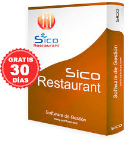
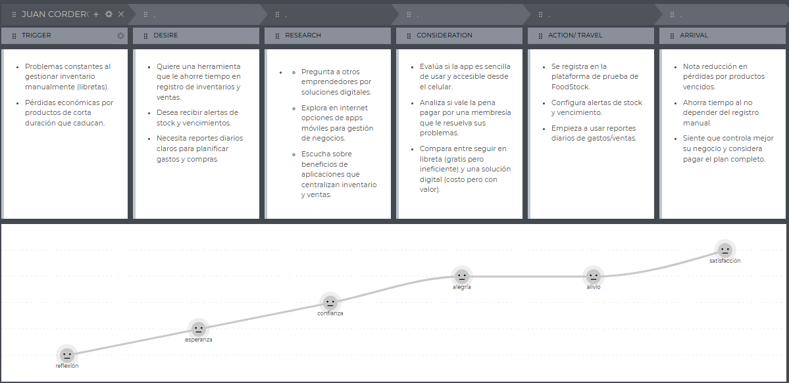
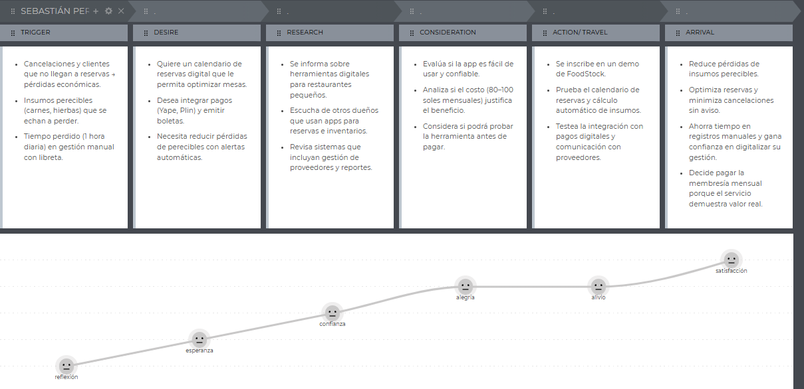
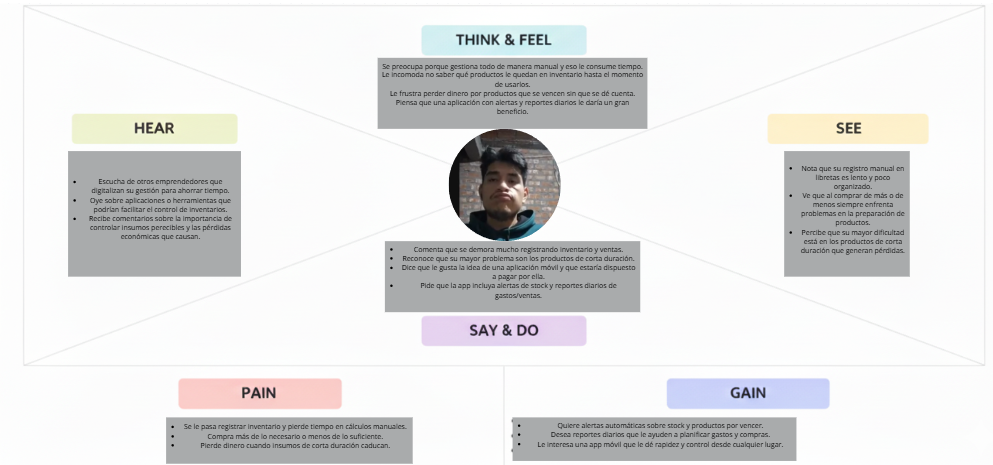
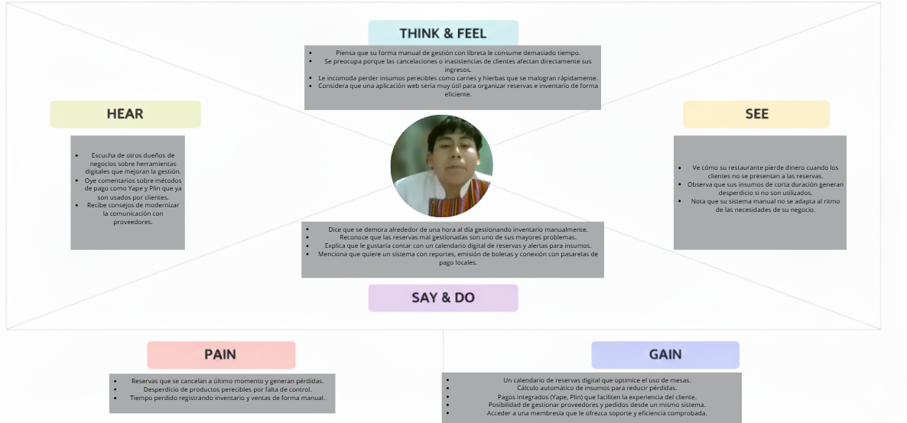

<h3>Universidad Peruana de Ciencias Aplicadas</h3>

 

<strong>Ingeniería de Software - 2025-2</strong> 
<strong>1ASI0730 - Aplicaciones Web</strong> 
<strong>NRC: 7420</strong> 
<strong>Profesor: Alex Humberto Sánchez Ponce</strong> 

 <strong>Informe del Trabajo Final</strong>  

<strong>Startup: GestionPro </strong> 
<strong>Producto: FoodStock</strong> 

### Team Members:

|             Member              |    Code    |
|:-------------------------------:|:----------:|
|  José María Franco Del Carpio   |    ...     |
|   Jean Pool Huaman De La Cruz   |    ...     |
|  Javier Masaru Nikaido Vargas   |    ...     |
| Quintanilla Pozo Gonzalo Samuel | u202315007 |
|  Melina Liz Santillan Alvarado  |    ...     |

<strong> Setiembre 2025</strong> 

# Registro de Versiones del Informe

# Project Report Collaboration Insights

---

# Contenido

## Tabla de contenidos
- [Student Outcome](#student-outcome)
- [Capítulo I: Introducción](#capítulo-i-introducción)
    - [1.1. Startup Profile](#11-startup-profile)
        - [1.1.1. Descripción de la Startup](#111-descripción-de-la-startup)
        - [1.1.2. Perfiles de integrantes del equipo](#112-perfiles-de-integrantes-del-equipo)
    - [1.2. Solution Profile](#12-solution-profile)
        - [1.2.1. Antecedentes y problemática](#121-antecedentes-y-problemática)
        - [1.2.2. Lean UX Process](#122-lean-ux-process)
            - [1.2.2.1. Lean UX Problem Statements](#1221-lean-ux-problem-statements)
            - [1.2.2.2. Lean UX Assumptions](#1222-lean-ux-assumptions)
            - [1.2.2.3. Lean UX Hypothesis Statements](#1223-lean-ux-hypothesis-statements)
            - [1.2.2.4. Lean UX Canvas](#1224-lean-ux-canvas)
    - [1.3. Segmentos objetivo](#13-segmentos-objetivo)
- [Capítulo II: Requirements Elicitation & Analysis](#capítulo-ii-requirements-elicitation--analysis)
    - [2.1. Competidores](#21-competidores)
        - [2.1.1. Análisis competitivo](#211-análisis-competitivo)
        - [2.1.2. Estrategias y tácticas frente a competidores](#212-estrategias-y-tácticas-frente-a-competidores)
    - [2.2. Entrevistas](#22-entrevistas)
        - [2.2.1. Diseño de entrevistas](#221-diseño-de-entrevistas)
        - [2.2.2. Registro de entrevistas](#222-registro-de-entrevistas)
        - [2.2.3. Análisis de entrevistas](#223-análisis-de-entrevistas)
    - [2.3. Needfinding](#23-needfinding)
        - [2.3.1. User Personas](#231-user-personas)
        - [2.3.2. User Task Matrix](#232-user-task-matrix)
        - [2.3.3. User Journey Mapping](#233-user-journey-mapping)
        - [2.3.4. Empathy Mapping](#234-empathy-mapping)
    - [2.4. Big Picture EventStorming](#24-big-picture-eventstorming)
    - [2.5. Ubiquitous Language](#25-ubiquitous-language)
- [Capítulo III: Requirements Specification](#capítulo-iii-requirements-specification)
    - [3.1. To-Be Scenario Mapping](#31-to-be-scenario-mapping)
    - [3.2. User Stories](#32-user-stories)
    - [3.3. Impact Mapping](#33-impact-mapping)
    - [3.4. Product Backlog](#34-product-backlog)
- [Capítulo IV: Product Design](#capítulo-iv-product-design)
    - [4.1. Style Guidelines](#41-style-guidelines)
        - [4.1.1. General Style Guidelines](#411-general-style-guidelines)
        - [4.1.2. Web Style Guidelines](#412-web-style-guidelines)
    - [4.2. Information Architecture](#42-information-architecture)
        - [4.2.1. Organization Systems](#421-organization-systems)
        - [4.2.2. Labeling Systems](#422-labeling-systems)
        - [4.2.3. SEO Tags and Meta Tags](#423-seo-tags-and-meta-tags)
        - [4.2.4. Searching Systems](#424-searching-systems)
        - [4.2.5. Navigation Systems](#425-navigation-systems)
    - [4.3. Landing Page UI Design](#43-landing-page-ui-design)
        - [4.3.1. Landing Page Wireframe](#431-landing-page-wireframe)
        - [4.3.2. Landing Page Mock-up](#432-landing-page-mock-up)
    - [4.4. Web Applications UX/UI Design](#44-web-applications-uxui-design)
        - [4.4.1. Web Applications Wireframes](#441-web-applications-wireframes)
        - [4.4.2. Web Applications Wireflow Diagrams](#442-web-applications-wireflow-diagrams)
        - [4.4.2. Web Applications Mock-ups](#442-web-applications-mock-ups)
        - [4.4.3. Web Applications User Flow Diagrams](#443-web-applications-user-flow-diagrams)
    - [4.5. Web Applications Prototyping](#45-web-applications-prototyping)
    - [4.6. Domain-Driven Software Architecture](#46-domain-driven-software-architecture)
        - [4.6.1. Software Architecture Context Diagram](#461-software-architecture-context-diagram)
        - [4.6.2. Software Architecture Container Diagrams](#462-software-architecture-container-diagrams)
        - [4.6.3. Software Architecture Components Diagrams](#463-software-architecture-components-diagrams)
    - [4.7. Software Object-Oriented Design](#47-software-object-oriented-design)
        - [4.7.1. Class Diagrams](#471-class-diagrams)
    - [4.8. Database Design](#48-database-design)
        - [4.8.1. Database Diagrams](#481-database-diagrams)
- [Capítulo V: Product Implementation, Validation & Deployment](#capítulo-v-product-implementation-validation--deployment)
    - [5.1. Software Configuration Management](#51-software-configuration-management)
        - [5.1.1. Software Development Environment Configuration](#511-software-development-environment-configuration)
        - [5.1.2. Source Code Management](#512-source-code-management)
        - [5.1.3. Source Code Style Guide & Conventions](#513-source-code-style-guide--conventions)
        - [5.1.4. Software Deployment Configuration](#514-software-deployment-configuration)
    - [5.2. Landing Page, Services & Applications Implementation](#52-landing-page-services--applications-implementation)
        - [5.2.1. Sprint 1](#521-sprint-1)
            - [5.2.1.1. Sprint Planning 1](#5211-sprint-planning-1)
            - [5.2.1.2. Aspect Leaders and Collaborators](#5212-aspect-leaders-and-collaborators)
            - [5.2.1.3. Sprint Backlog 1](#5213-sprint-backlog-1)
            - [5.2.1.4. Development Evidence for Sprint Review](#5214-development-evidence-for-sprint-review)
            - [5.2.1.5. Execution Evidence for Sprint Review](#5215-execution-evidence-for-sprint-review)
            - [5.2.1.6. Services Documentation Evidence for Sprint Review](#5216-services-documentation-evidence-for-sprint-review)
            - [5.2.1.7. Software Deployment Evidence for Sprint Review](#5217-software-deployment-evidence-for-sprint-review)
            - [5.2.1.8. Team Collaboration Insights during Sprint](#5218-team-collaboration-insights-during-sprint)
    - [5.3. Validation Interviews](#53-validation-interviews)
      - [5.3.1. Diseño de Entrevistas](#531-diseño-de-entrevistas)
      - [5.3.2. Registro de Entrevistas](#532-registro-de-entrevistas)
      - [5.3.3. Evaluaciones según heurísticas](#533-evaluaciones-según-heurísticas)
    - [5.4. Video About-the-Product](#54-video-about-the-product)
- [Conclusiones](#conclusiones)
- [Conclusiones y recomendaciones](#conclusiones-y-recomendaciones)
- [Video About-the-Team](#video-about-the-team)
- [Bibliografía](#bibliografía)
- [Anexos](#anexos)

---

## Student Outcome

## Capítulo I: Introducción
### 1.1. Startup Profile
#### 1.1.1. Descripción de la Startup
#### 1.1.2. Perfiles de integrantes del equipo
### 1.2. Solution Profile
#### 1.2.1. Antecedentes y problemática
#### 1.2.2. Lean UX Process
##### 1.2.2.1. Lean UX Problem Statements
##### 1.2.2.2. Lean UX Assumptions
##### 1.2.2.3. Lean UX Hypothesis Statements
##### 1.2.2.4. Lean UX Canvas
### 1.3. Segmentos objetivo

## Capítulo II: Requirements Elicitation & Analysis
### 2.1. Competidores
#### 2.1.1. Análisis competitivo
El análisis competitivo tiene como objetivo principal identificar las características de los competidores, evaluar sus fortalezas y debilidades, y encontrar maneras de diferenciarnos para 
obtener una ventaja competitiva.

<table>
  <thead>
    <tr>
      <th colspan="7"><b>Competitive Analysis Landscape</b></th>
    </tr>
  </thead>
  <tbody>
    <tr>
      <td colspan="2" align="center">¿Por qué llevar a cabo este análisis?</td>
      <td colspan="5" align="center">El objetivo de este análisis es identificar las características de los competidores, evaluar sus fortalezas y debilidades, y encontrar maneras de diferenciarnos para obtener una ventaja competitiva.</td>
    </tr>
      <tr>
    <td colspan="2" rowspan="2" valign="top">Startup y Competidores</td>
        <td valign="top" align="center">FoodStock</td>
        <td valign="top" align="center">SICO RESTAURANTES</td>
        <td valign="top" align="center">Xtrachef </td>
        <td valign="top" align="center">Panca</td>
  </tr>
  <tr>
    <td valign="top" align="center"></td>
    <td valign="top" align="center"></td>
    <td valign="top" align="center"></td>
    <td valign="top" align="center"></td>
   </tr>
  <tr>
    <td rowspan="2" valign="top">Perfil</td>
    <td valign="top">Overview</td>
    <td valign="top">FoodStock es una aplicación web orientada a optimizar la gestión de inventario y ventas en el sector gastronómico. Permite a los dueños y administradores registrar, supervisar y analizar sus operaciones, fortaleciendo la calidad del servicio y la rentabilidad.</td>
    <td valign="top">SICO RESTAURANTES es un software de gestión para restaurantes que se enfoca en el control del día a día, incluyendo inventario en línea, manejo de recetas, facturación electrónica y gestión de comandas táctiles.</td>
    <td valign="top">Xtrachef es una herramienta de gestión de inventario y costos diseñada específicamente para el sector gastronómico. Su enfoque principal es el control de recetas, insumos y mermas para optimizar la rentabilidad del negocio.</td>
    <td valign="top">Panca es un sistema de gestión para restaurantes que integra múltiples funcionalidades, como el punto de venta (POS), inventario y un sistema para gestionar pedidos y delivery.</td>
  </tr>
  <tr>
    <td valign="top">Ventaja competitiva ¿Qué valor ofrece a los clientes?</td>
    <td valign="top">FoodStock se diferencia por ofrecer una solución que es accesible, fácil de usar y escalable. Proporcionamos una herramienta que no solo organiza, sino que también ayuda a los clientes a aumentar su rentabilidad con análisis clave, ideal para emprendedores y microempresas.</td>
    <td valign="top">Su valor principal es la automatización y la integración de procesos clave, como comandas táctiles y facturación electrónica, en un solo sistema fácil de usar para restaurantes establecidos y de diversos tipos.</td>
    <td valign="top">Ofrecen una solución altamente especializada en el control de costos y rentabilidad por plato, lo que lo hace muy atractivo para chefs y gerentes de costos.</td>
    <td valign="top">Su ventaja radica en ser una solución todo-en-uno que cubre la mayoría de las necesidades operativas de un restaurante, desde el inventario hasta la gestión del salón y el delivery.</td>
  </tr>
  <tr>
    <td rowspan="2" valign="top">Perfil de Marketing</td>
    <td valign="top">Mercado objetivo</td>
    <td valign="top">Emprendedores gastronómicos y dueños de pequeños negocios de comida que buscan una solución simple y económica para digitalizar su gestión.</td>
    <td valign="top">Restaurantes, restobares, cafés y casinos de comida ya establecidos que buscan un control integral de sus operaciones.</td>
    <td valign="top">Gerentes de costos y chefs que buscan una herramienta especializada en la optimización de la rentabilidad del menú, el control de recetas y la gestión de mermas.</td>
    <td valign="top">Dueños y administradores de restaurantes que necesitan una solución todo-en-uno que integre POS, inventario, delivery y un sistema de gestión completo.</td>
  </tr>
  <tr>
    <td valign="top">Estrategias de marketing</td>
    <td valign="top">Publicidad en redes sociales (Facebook, Instagram) con un enfoque en la simplicidad y el ahorro de tiempo</td>
    <td valign="top">Demo y prueba gratuita: Ofrecen una prueba gratuita de 30 días para que los clientes puedan evaluar la funcionalidad del software.</td>
    <td valign="top">Publicidad en plataformas especializadas, eventos del sector y colaboraciones con organizaciones que promueven la innovación en la agricultura.</td>
    <td valign="top">Ventas consultivas, demostraciones del producto a equipos gerenciales y campañas de marketing de contenidos que demuestran la funcionalidad de su Sistema.</td>
  </tr>
  <tr>
    <td rowspan="3" valign="top">Perfil de Producto</td>
    <td valign="top">Productos & Servicios</td>
    <td valign="top">Módulo de gestión de inventario, registro de ventas y para el otro plan seria módulo de análisis de rentabilidad, sistema de reservas, reportes avanzados.</td>
    <td valign="top">Módulos de inventario y stock, manejo de recetas, comandas táctiles, facturación electrónica y reportes de ventas.</td>
    <td valign="top">Control de recetas, mermas, y precios de menú.</td>
    <td valign="top">POS, inventario, delivery, gestión de pedidos.</td>
  </tr>
  <tr>
    <td valign="top">Precios & Costos</td>
    <td valign="top">Costo Mensual para el plan básico ($5 USD), Plan Pro ($25 USD).</td>
    <td valign="top">(No se conoce el precio mensual)</td>
    <td valign="top">(No se conoce el precio mensual)</td>
    <td valign="top">(No se conoce el precio mensual)</td>
  </tr>
  <tr>
    <td valign="top">Canales de distribución (Web y/o Móvil)</td>
    <td valign="top">Plataforma web responsiva para PC, Tablet y celular, disponible desde cualquier navegador y no requiere descargar una app para usarla.</td>
    <td valign="top">Ofrecen soluciones en la nube, pero también se pueden instalar en computadoras de escritorio.</td>
    <td valign="top">Aplicación web con un enfoque en la usabilidad móvil para el uso en la cocina.</td>
    <td valign="top">Solución en la nube accesible desde web y con aplicaciones dedicadas para dispositivos móviles.</td>
  </tr>
  <tr>
    <td rowspan="4" valign="top">Análisis SWOT</td>
    <td valign="top">Fortalezas</td>
    <td valign="top">Precios bajos para un mercado que no puede pagar soluciones más caras, interfaz intuitiva y facil de usar, ideal para emprendedores con poca conocimiento tecnologico y rentabilidad en dar herramientas claves para que los negocios crezcan.</td>
    <td valign="top">Tiene más de 25 años en la industria del software, lo que genera confianza a los clientes e integra multiples funcionalidades operativas en un solo software.</td>
    <td valign="top">Herramienta enfocada en un nicho muy especifico que hace muy valioso para gerentes.</td>
    <td valign="top">Proporcionan un ecosistema completo para el negocio, desde el POS hasta la gestión de inventario.</td>
  </tr>
  <tr>
    <td valign="top">Debilidades</td>
    <td valign="top">Al ser esta un nuevo Startup tiene un bajo notoriedad de marca. Tambien el plan basico no tiene todas las herramientas que podría tener la competencia.</td>
    <td valign="top">El precio puede ser muy alto para los pequeños negocios, ya que esta diseñado para empresas establecidas.</td>
    <td valign="top">Su especialización en costos podría no ser atractiva para negocios que buscan una solución integral.</td>
    <td valign="top">Su especialización en costos podría no ser atractiva para negocios que buscan una solución integral y sus costos son muy elevados para los negocios que recien estan empezando.</td>
  </tr>
  <tr>
    <td valign="top">Oportunidades</td>
    <td valign="top">El sector gastronómico se está digitalizando, lo que crea una alta demanda de herramientas como FoodStock y un vacío para una solución que sea económica, simple y que se enfoque en la rentabilidad de los negocios pequeños.</td>
    <td valign="top">Pueden ofrecer soluciones a otros tipos de negocios (hoteles, minimarkets) para seguir creciendo.</td>
    <td valign="top">Pueden colaborar con plataformas de POS o de inventario para complementar sus funciones.</td>
    <td valign="top">Tienen la oportunidad de seguir creciendo al ofrecer más funcionalidades a sus clientes.</td>
  </tr>
  <tr>
    <td valign="top">Amenazas</td>
    <td valign="top">Pueden surgir competidores que ofrezcan soluciones gratuitas o más baratas y algunos emprendedores prefiren seguir con sus métodos manuales tradicionales.</td>
    <td valign="top">La entrada de nuevas startups con precios más competitivos puede afectar su cuota de mercado.</td>
    <td valign="top">El surgimiento de nuevas herramientas puede volver obsoleto su modelo de control de costos.</td>
    <td valign="top">Al ser un software "todo-en-uno", la llegada de soluciones más especializadas podría afectar su posición.</td>
  </tr>
  <tr>
    <td rowspan="4" valign="top">Precios y costos</td>
    <td valign="top">Costo Anual</td>
    <td valign="top">Desde $60 USD hasta $300 USD.</td>
    <td valign="top">(No se conoce el precio anual).</td>
    <td valign="top">(No se conoce el precio anual).</td>
    <td valign="top">(No se conoce el precio anual).</td>
  </tr>
  <tr>
    <td valign="top">Mensual</td>
    <td valign="top">Plan basico de $5 y pro de $25 USD</td>
    <td valign="top">(No se conoce el precio mensual)</td>
    <td valign="top">(No se conoce el precio mensual)</td>
    <td valign="top">(No se conoce el precio mensual)</td>
  </tr>
</table>

#### 2.1.2. Estrategias y tácticas frente a competidores

Basándonos en el análisis competitivo frente a plataformas como **SICO RESTAURANTES, Xtrachef y Panca**, se proponen las siguientes estrategias y tácticas para posicionar a **FoodStock** como una solución diferenciada y adaptada al contexto de emprendedores y microempresas gastronómicas en el Perú:  

**Estrategia 1: Accesibilidad y precios competitivos**  
- Mantener planes asequibles desde **$5 USD mensuales**, destacando la relación costo-beneficio frente a sistemas más caros.  
- Ofrecer un **plan freemium de prueba** con funciones básicas y la opción de experimentar las características Pro.  
- Comunicar claramente los beneficios económicos del sistema (ahorro de tiempo, reducción de mermas, control en tiempo real).  

**Estrategia 2: Enfoque en microempresas y emprendimientos**  
- Diseñar campañas dirigidas a dueños de **pequeños restaurantes y negocios emergentes** que no pueden costear soluciones complejas.  
- Resaltar la **simplicidad de uso** de la plataforma para usuarios con poca experiencia tecnológica.  
- Presentar casos de uso reales de microempresas que hayan mejorado su rentabilidad gracias a la digitalización.  

**Estrategia 3: Diferenciación por escalabilidad funcional**  
- Ofrecer dos planes de servicio: **Básico** (inventario y ventas) y **Pro** (análisis de rentabilidad, reservas y alertas predictivas).  
- Posicionar al plan Pro como una alternativa más completa frente a sistemas especializados como Xtrachef o soluciones “todo-en-uno” como Panca.  
- Mostrar la evolución natural de crecimiento: empezar simple y luego pasar a funciones avanzadas.  

**Estrategia 4: Marketing digital de bajo costo y alto alcance**  
- Publicidad en **redes sociales (Facebook, Instagram)** con mensajes claros sobre organización, simplicidad y ahorro de tiempo.  
- Uso de **tutoriales audiovisuales y guías rápidas** para demostrar la facilidad de implementación.  
- Aprovechar **alianzas con asociaciones gastronómicas** para ganar visibilidad y confianza en el sector.  

**Estrategia 5: Experiencia de usuario intuitiva y confiable**  
- Priorizar un diseño visual simple y accesible desde cualquier dispositivo sin necesidad de instalación adicional.  
- Implementar **notificaciones inteligentes** (bajo stock, ventas destacadas, reservas pendientes).  
- Garantizar **datos actualizados en tiempo real**, fortaleciendo la confianza del usuario en la plataforma.  

**Estrategia 6: Posicionamiento como aliado estratégico de negocios pequeños**  
- Promover testimonios de usuarios que lograron reducir mermas y mejorar la gestión con FoodStock.  
- Participar en **eventos de innovación gastronómica y digitalización de pymes**.  
- Comunicar el impacto positivo en la **rentabilidad y eficiencia operativa** de los negocios que adoptan la solución.  
### 2.2. Entrevistas
#### 2.2.1. Diseño de entrevistas
#### Emprendedores
1. ¿Cómo gestionas normalmente tu inventario y tus ventas?
2. ¿Qué dificultades tienes en el control de stock en tu inventario?
3. ¿Cuánto tiempo requieres para registrar todo tu inventario?
4. ¿Qué problemas tienes con los alimentos de corta duración?
5. ¿Qué opinas sobre una aplicación web que te permita gestionar tu inventario y tus ventas?
6. ¿Qué otras funcionalidades desearías que tenga la aplicación web?
7. ¿Qué información desearías que tenga un reporte de ventas?
8. ¿Estarías dispuesto a pagar una membresía mensual para acceder a una aplicación web que te ayude en tu área de operaciones y comercial? ¿Por qué?
9. ¿Qué beneficios crees que podría tener tu emprendimiento si accedieras a esta aplicación web?

#### Microempresas
1. ¿Cómo gestionas normalmente tu inventario y tus ventas?
2. ¿Qué dificultades tienes en las reservas de mesas?
3. ¿Qué herramienta utilizas para hacer el registro de una reserva de mesa?
4. ¿Cuánto tiempo requieres para registrar todo tu inventario?
5. ¿Qué dificultades tienes en el control de stock en tu inventario?
6. ¿Qué opinas sobre una aplicación web que te permita gestionar tu inventario y tus ventas?
7. ¿Qué otras funcionalidades desearías que tenga la aplicación web?
8. ¿Qué información desearías que tenga un reporte de ventas?
9. ¿Qué problemas tienes con los alimentos de corta duración?
10. ¿Estarías dispuesto a pagar una membresía mensual para acceder a una aplicación web que te ayude en tu área de operaciones y comercial? ¿Por qué?

#### 2.2.2. Registro de entrevistas

___

#### Segmento Emprendedor:

Entrevista 1:

| Nombre                | Adriano Samuel Alzamora Carrillo                                                                                                                                                                                                                                                                                                                                                                                                                                                                                                                                                                                                                                                                                               |
|-----------------------|--------------------------------------------------------------------------------------------------------------------------------------------------------------------------------------------------------------------------------------------------------------------------------------------------------------------------------------------------------------------------------------------------------------------------------------------------------------------------------------------------------------------------------------------------------------------------------------------------------------------------------------------------------------------------------------------------------------------------------|
| Resumen de Entrevista | El nos comenta que su manera de gestionar es de lo tradicional usando libretas y asi; pero tiene una dificultad que es que no siempre lo mantiene actualizado lo que le quita tiempo y aveces se le pasa algunas cosas y no lo organiza al dia. También se le dificulta no saber que productos le quedan en su inventario al momento de usarlo lo que genera dificultades al momento de los pedidos y también cuando un producto esta por vencer el no tiene noción de ello y pierde dinero lo que le gastaría que haya una alerta para ello. El estaría dispuesto a invertir en una app web que resuelva todas sus dificultades al momento de organizar, enviar un mensaje de alerta para la fecha de vencimiento y todo eso. |
| Evidencia             |                                                                                                                                                                                                                                                                                                                                                                                                                                                                                                                                                                                                                                                      |
| Link del video        | [Enlace a video en Microsfot](https://upcedupe-my.sharepoint.com/:v:/g/personal/u202315007_upc_edu_pe/EbU8HGvvPFREpfbZIrBkn8oBV6NXCJx6WqBd5TEaRb3WvA?e=KGayi2&nav=eyJyZWZlcnJhbEluZm8iOnsicmVmZXJyYWxBcHAiOiJTdHJlYW1XZWJBcHAiLCJyZWZlcnJhbFZpZXciOiJTaGFyZURpYWxvZy1MaW5rIiwicmVmZXJyYWxBcHBQbGF0Zm9ybSI6IldlYiIsInJlZmVycmFsTW9kZSI6InZpZXcifX0%3D)                                                                                                                                                                                                                                                                                                                                                                                                                                                                                                                                                                                                                                                                                                |

Entrevista 2:

| Nombre                | Juan Cordero                                                                                                                                                                                                                                                                                                                                                                                                                                                                                                                                                                                                                                                                                                                                                                                                                                                                                                                                         |
|-----------------------|------------------------------------------------------------------------------------------------------------------------------------------------------------------------------------------------------------------------------------------------------------------------------------------------------------------------------------------------------------------------------------------------------------------------------------------------------------------------------------------------------------------------------------------------------------------------------------------------------------------------------------------------------------------------------------------------------------------------------------------------------------------------------------------------------------------------------------------------------------------------------------------------------------------------------------------------------|
| Resumen de Entrevista | Nos comenta que el gestiona todo de manera manual, tanto los gastos, inventario y lo que vende cada dia, también tiene el problema de comprar de mas de lo necesario y de no comprar lo suficiente y no se da cuenta hasta que esta preparando su producto aparte de que se demora mucho en registrar el inventario y sacar las cuentas de las ventas. Y en cuanto a los productos con corta duración es su mayor problema por que ya no se va a poder utilizar y significaría una perdida de tiempo. Se le comento al usuario sobre una herramienta para que le ayude a su gestión, y nos dijo que le gusta y estaría dispuesto a pagar y mas si es en celular, también dijo que le gustaría que hayan alertas del stock o falta de ingrediente y le gustaría saber que en el reporte haya información del día en cuanto gasta y todo ya que tendría un gran beneficio al obtener ese tipo de información al momento de comprar nuestra aplicación. |
| Evidencia             |                                                                                                                                                                                                                                                                                                                                                                                                                                                                                                                                                                                                                                                                                                                                                                                                                                                                         |
| Link del video        | [Enlace a video en Microsfot](https://upcedupe-my.sharepoint.com/:v:/g/personal/u202315007_upc_edu_pe/EWhmvu1d6HlPjaAkwi_0XuoBZIWx9ISXWZZ4meTo4SI0xg?e=LkgYEJ&nav=eyJyZWZlcnJhbEluZm8iOnsicmVmZXJyYWxBcHAiOiJTdHJlYW1XZWJBcHAiLCJyZWZlcnJhbFZpZXciOiJTaGFyZURpYWxvZy1MaW5rIiwicmVmZXJyYWxBcHBQbGF0Zm9ybSI6IldlYiIsInJlZmVycmFsTW9kZSI6InZpZXcifX0%3D)                                                                                                                                                                                                                                                                                                                                                                                                                                                                                                                                                                                                                                                                                                                                                                                                                                                                                                                      |

Entrevista 3:

| Nombre                | Mercedes                                                                                                                                                                                                                                                                                                                                                                                                                                                                                                           |
|-----------------------|--------------------------------------------------------------------------------------------------------------------------------------------------------------------------------------------------------------------------------------------------------------------------------------------------------------------------------------------------------------------------------------------------------------------------------------------------------------------------------------------------------------------|
| Resumen de Entrevista | Esta emprendedora nos comenta que también ingresa los datos de manera manual en una libreta y también a veces no se da cuenta de que se acaban ciertos insumos y su perdida. Nos comenta también que se demora bastante al registrar todo su inventario y tiene problemas de sabor con los alimentos de corta duración que afecta a su emprendimiento. Ella dijo que le agrada y gustaría que hubiera la pagina web que le ayude a ordenar todas sus cosas y que tenga alerta para los alimentos de corta duración |
| Evidencia             |                                                                                                                                                                                                                                                                                                                                                                                                                                       |
| Link del video        | [Enlace a video en Microsfot](https://upcedupe-my.sharepoint.com/:v:/g/personal/u202315007_upc_edu_pe/EepNa_yF8BxLvv8d9S5DifUBMfhE_N6oTaLrFBkhxsFbIw?e=5oaMTC&nav=eyJyZWZlcnJhbEluZm8iOnsicmVmZXJyYWxBcHAiOiJTdHJlYW1XZWJBcHAiLCJyZWZlcnJhbFZpZXciOiJTaGFyZURpYWxvZy1MaW5rIiwicmVmZXJyYWxBcHBQbGF0Zm9ybSI6IldlYiIsInJlZmVycmFsTW9kZSI6InZpZXcifX0%3D)                                                                                                                                                                                                                                                                                                                                                                                                                                                                                    |

___

#### Segmento Microempresas:

Entrevista 1:

| Nombre                | Manuel Alejandro Sahuaraura Lucana                                                                                                                                                                                                                                                                                                                                                                                                                                                                                                                                                                                                                                                                                                                                                   |
|-----------------------|--------------------------------------------------------------------------------------------------------------------------------------------------------------------------------------------------------------------------------------------------------------------------------------------------------------------------------------------------------------------------------------------------------------------------------------------------------------------------------------------------------------------------------------------------------------------------------------------------------------------------------------------------------------------------------------------------------------------------------------------------------------------------------------|
| Resumen de Entrevista | La entrevista con un administrador de una microempresa en el sector turístico reveló que, a pesar de ya utilizar sistemas digitales, su gestión es fragmentada, lo que les causa desorden y pérdida de datos. Su principal desafío es la falta de integración entre las ventas y reservas recibidas por múltiples canales (email, WhatsApp) y su sistema de inventario. A esto se suma el problema de gestionar pérdidas por productos perecibles, lo cual no se registra correctamente en su stock. La microempresa no solo busca un software, sino una solución integral que automatice el flujo completo de sus operaciones, desde la compra de insumos hasta la venta final, y está dispuesta a pagar por un servicio completo con soporte que garantice una optimización total. |
| Evidencia             |                                                                                                                                                                                                                                                                                                                                                                                                                                                                                                                                                                                                                                                                                                         |
| Link del video        | [Enlace a video en Microsfot](https://upcedupe-my.sharepoint.com/:v:/g/personal/u202315007_upc_edu_pe/Ec88oj9uNnxKnxqqDrdVtIMBEivVHjq4lsgwAS0SWoJsQg?e=f98SEY&nav=eyJyZWZlcnJhbEluZm8iOnsicmVmZXJyYWxBcHAiOiJTdHJlYW1XZWJBcHAiLCJyZWZlcnJhbFZpZXciOiJTaGFyZURpYWxvZy1MaW5rIiwicmVmZXJyYWxBcHBQbGF0Zm9ybSI6IldlYiIsInJlZmVycmFsTW9kZSI6InZpZXcifX0%3D)                                                                                                                                                                                                                                                                                                                                                                                                                                                                                                                                                                                                                                                                                                                                                      |

Entrevista 2:

| Nombre                | Siri                                                                                                                                                                                                                                                                                                                                                                                                                                                                                                                                                                                                                                                                                                                                                                                                                                                                                                                                              |
|-----------------------|---------------------------------------------------------------------------------------------------------------------------------------------------------------------------------------------------------------------------------------------------------------------------------------------------------------------------------------------------------------------------------------------------------------------------------------------------------------------------------------------------------------------------------------------------------------------------------------------------------------------------------------------------------------------------------------------------------------------------------------------------------------------------------------------------------------------------------------------------------------------------------------------------------------------------------------------------|
| Resumen de Entrevista | La entrevistada, que administra un restaurante, ha comenzado a usar un sistema digital para sus registros, pero aún enfrenta desafíos importantes. Dedica alrededor de tres horas al día a registrar su inventario, un proceso que se complica con productos que no se venden por peso. Su mayor problema es la pérdida económica debido a la corta duración de productos como el pescado y marisco, que si no se venden el mismo día se convierten en una pérdida. En cuanto a las reservas, su principal dificultad son los clientes que no llegan o cancelan a último minuto, lo que causa una pérdida de clientes y mesas. La entrevistada ve un gran potencial en una aplicación web que le ayude, especialmente con alertas para productos perecibles y reportes que muestren los productos más vendidos. Está dispuesta a pagar una membresía mensual, siempre y cuando el sistema demuestre un claro beneficio y ofrezca un buen soporte. |
| Evidencia             |                                                                                                                                                                                                                                                                                                                                                                                                                                                                                                                                                                                                                                                                                                                                                                                                                                                                      |
| Link del video        | [Enlace a video en Microsfot](https://upcedupe-my.sharepoint.com/:v:/g/personal/u202315007_upc_edu_pe/EXKVWcb4e4BEnF4QNkoW7_ABNOsspKtpA7QWpgEeSpHTNQ?e=dfFQHd&nav=eyJyZWZlcnJhbEluZm8iOnsicmVmZXJyYWxBcHAiOiJTdHJlYW1XZWJBcHAiLCJyZWZlcnJhbFZpZXciOiJTaGFyZURpYWxvZy1MaW5rIiwicmVmZXJyYWxBcHBQbGF0Zm9ybSI6IldlYiIsInJlZmVycmFsTW9kZSI6InZpZXcifX0%3D)                                                                                                                                                                                                                                                                                                                                                                                                                                                                                                                                                                                                                                                                                                                                                                                                                                                                                                                   |

Entrevista 3:

| Nombre                | Sebastián Fernando Pereira Chávez                                                                                                                                                                                                                                                                                                                                                                                                                                                                                                                                                                                                                                                                                                                                                                                                                                                                                                                                                                                                   |
|-----------------------|-------------------------------------------------------------------------------------------------------------------------------------------------------------------------------------------------------------------------------------------------------------------------------------------------------------------------------------------------------------------------------------------------------------------------------------------------------------------------------------------------------------------------------------------------------------------------------------------------------------------------------------------------------------------------------------------------------------------------------------------------------------------------------------------------------------------------------------------------------------------------------------------------------------------------------------------------------------------------------------------------------------------------------------|
| Resumen de Entrevista | El entrevistado, un chef de profesión y dueño de un restaurante pequeño, gestiona su inventario y ventas de forma manual con una libreta, lo que le consume aproximadamente una hora al día. Su principal dificultad son las reservas, ya que al ser un local pequeño, los clientes que no se presentan o cancelan de último minuto le generan pérdidas. En cuanto al inventario, su mayor problema son los insumos perecibles (carnes, hierbas) que, si no se usan, se echan a perder. A pesar de su enfoque tradicional, considera que una aplicación web sería muy útil para gestionar reservas, optimizar su inventario y comunicarse con sus proveedores. Desea que la aplicación incluya un calendario de reservas, cálculo automático de insumos, emisión de boletas, conexión con un sistema como "Yape, Plin" y la posibilidad de gestionar proveedores y pedidos. Estaría dispuesto a pagar entre 80 y 100 soles mensuales por una membresía, siempre que pueda probar el servicio primero para verificar su efectividad. |
| Evidencia             |                                                                                                                                                                                                                                                                                                                                                                                                                                                                                                                                                                                                                                                                                                                                                                                                                                                                                                                                                        |
| Link del video        | [Enlace a video en Microsfot](https://upcedupe-my.sharepoint.com/:v:/g/personal/u202315007_upc_edu_pe/EStxK5hSH6VIu0vPGe0aOhEBzxkqq_IrWQESrFMicarRgA?e=0pC2rZ&nav=eyJyZWZlcnJhbEluZm8iOnsicmVmZXJyYWxBcHAiOiJTdHJlYW1XZWJBcHAiLCJyZWZlcnJhbFZpZXciOiJTaGFyZURpYWxvZy1MaW5rIiwicmVmZXJyYWxBcHBQbGF0Zm9ybSI6IldlYiIsInJlZmVycmFsTW9kZSI6InZpZXcifX0%3D)                                                                                                                                                                                                                                                                                                                                                                                                                                                                                                                                                                                                                                                                                                                                                                                                                                                                                                                                                                                                                                    |

#### 2.2.3. Análisis de entrevistas

El análisis de las entrevistas confirma que tanto los Emprendedores como las Microempresas enfrentan desafíos en la gestión de sus operaciones, aunque sus necesidades varían.
___
**Puntos de Dolor en Común**

A pesar de sus diferencias, ambos segmentos comparten problemas fundamentales que una solución digital podría resolver:

* **Gestión de inventario ineficiente:** Todos los entrevistados, sin excepción, señalan la dificultad de llevar un control de su stock. Mencionan la pérdida de tiempo al registrar inventarios y la pérdida económica por productos perecibles que no se usan a tiempo.

* **Problemas con reservas y ventas:** La falta de un sistema centralizado para gestionar reservas y ventas es una fuente de pérdidas de clientes y desorganización.

* **Interés en soluciones digitales:** Ambos segmentos expresan una alta disposición a invertir en una aplicación que les ayude a resolver sus problemas, lo que valida la viabilidad del proyecto.
___
**Diferencias Clave entre Segmentos**

El análisis también revela que las necesidades de los dos segmentos se encuentran en diferentes niveles de madurez digital:

* **Emprendedores:** Su principal necesidad es pasar de un sistema manual (libreta) a uno digital. Buscan una herramienta que les ofrezca organización y alertas básicas para optimizar su tiempo y evitar pérdidas de dinero. Valoran la sencillez y la accesibilidad.

* **Microempresas:** Aunque ya usan algunas herramientas digitales, su problema es la falta de integración y la ineficiencia. Buscan una solución más robusta que les permita unificar todos sus canales (ventas, reservas, inventario, proveedores) en un solo sistema. Valoran el soporte constante y funcionalidades avanzadas que les ofrezcan un flujo de trabajo completo y automatizado.

### 2.3. Needfinding
#### 2.3.1. User Personas

### Segmento 1:

 
 
### Segmento 2:
 
 

 
#### 2.3.2. User Task Matrix

La *User Task Matrix* organiza y prioriza las tareas principales que los segmentos de usuarios deben realizar en el sistema.  
Esto permite identificar en qué funciones debe enfocarse FoodStock para responder a las necesidades reales de **emprendedores** y **microempresas**.

| Tareas principales                                   | Juan Cordero (Emprendedor) | Sebastián Pereira (Microempresa) |
|------------------------------------------------------|-----------------------------|----------------------------------|
| Registrar y gestionar inventario                     | Frecuencia: Siempre Importancia: Alta | Frecuencia: Siempre Importancia: Alta |
| Controlar insumos perecibles con alertas             | Frecuencia: A veces Importancia: Alta | Frecuencia: Siempre Importancia: Alta |
| Analizar ventas y gastos diarios                     | Frecuencia: Siempre Importancia: Alta | Frecuencia: A veces Importancia: Media |
| Generar reportes automatizados                       | Frecuencia: A veces Importancia: Media | Frecuencia: A veces Importancia: Alta |
| Gestionar proveedores y pedidos                      | Frecuencia: A veces Importancia: Media | Frecuencia: Siempre Importancia: Alta |
| Administrar reservaciones de clientes                |  No aplica                 | Frecuencia: Siempre Importancia: Alta |
| Conectar pagos digitales (Yape, Plin, etc.)          |  No aplica                 | Frecuencia: A veces Importancia: Alta |

---

#### Análisis

- **Emprendedores (Juan Cordero):**  
  Su foco está en **inventario, insumos perecibles y reportes diarios**, con énfasis en la simplicidad y ahorro de tiempo.  
  Las reservaciones no son relevantes para este segmento.

- **Microempresas (Sebastián Pereira):**  
  Requieren una **gestión más integral**, donde además del inventario, cobran gran importancia las **reservaciones, proveedores y pagos digitales**.  
  Sus operaciones son más complejas, por lo que valoran los reportes avanzados y la integración con métodos de pago.  

- **Coincidencias:**  
  Ambos segmentos valoran el **control del inventario** y la **gestión de productos perecibles** como actividades de alta frecuencia e importancia.

---

#### 2.3.3. User Journey Mapping

El **User Journey Mapping** permite visualizar la experiencia de los diferentes segmentos al interactuar con FoodStock, identificando emociones, puntos de dolor y oportunidades de mejora.

##### Caso 1: Emprendedor (ej. Juan Cordero)

    

##### Caso 2: Microempresa (ej. Sebastián Pereira)

    

---

#### 2.3.4. Empathy Mapping

### Juan Cordero
      
 
### Sebastián Fernando Pereira Chávez
  
### 2.4. Big Picture EventStorming
En esta sección, se detalla el proceso de Big Picture Event Storming que el equipo llevó a cabo para obtener una comprensión completa de las operaciones
del negocio de los restaurantes. El proceso se realizó de forma remota a través de una llamada en Discord, utilizando la herramienta Miro para plasmar visualmente la metodología.

#### 1. Open:
consiste en la exploración no estructurada de eventos. El objetivo principal fue generar la mayor cantidad de eventos de dominio posibles, es decir, 
todo lo que ocurre en el negocio de un restaurante. Estos eventos se escribieron en post-its naranjas y se colocaron en el tablero de Miro.

 

#### 2. Explore:
Después de la fase inicial de lluvia de ideas, el equipo se concentró en dar orden al caos. El objetivo principal fue convertir un conjunto de ideas 
dispersas en un mapa estructurado. Esto se logró a través de una revisión colaborativa de todos los eventos generados, reordenando los post-its naranjas en una única línea de tiempo, de izquierda a derecha.

 

Finalmente se muestra el Big Picture EventStorming:

 

#### 3. Close:
La fase de cierre representó la consolidación final de todo el trabajo realizado en el Event Storming. En lugar de ser un paso de creación, fue una etapa de documentación y análisis crítico. El equipo se
enfocó en tomar las decisiones finales y estructurar los hallazgos para convertirlos en un plan de acción claro.

 

Luego de hablar con mi grupo mejoramos e identificamos un mejor sistema

 
[Enlace del Miro donde se realizó el Big Picture Event Storming](https://miro.com/welcomeonboard/b1drT3dtWE13bnpIVkh2UkRUdlRlZmlsV1hRUHBHUHAxS2NwT0dkWGVkeXdVcjlPcXNVaHFpZE53SVhSNjFvdjhXMGZoclpZTjVWZVNBZDcyWFRPdzRhMFUwdXIwNThuaWpBa3F4dzlXUktKMGZSZFZxcjJ1cFo4NEhWd255N1V0R2lncW1vRmFBVnlLcVJzTmdFdlNRPT0hdjE=?share_link_id=544211227950)

Este proceso le dio al equipo una visión general de los eventos clave del negocio. Esto fue fundamental para identificar los puntos críticos y establecer las prioridades para las siguientes fases del proyecto.
### 2.5. Ubiquitous Language
El Lenguaje Ubicuo es el vocabulario común y consistente que el equipo ha definido para describir el negocio y el sistema, eliminando cualquier ambigüedad.
Los siguientes términos son clave para el entendimiento y desarrollo del proyecto GestionPro.

* Emprendedor / Microempresa: Actor principal del sistema, dueño de un negocio gastronómico. Es el usuario que interactúa con la plataforma para gestionar su restaurante.

* Venta registrada: Un hecho que ocurre en el sistema una vez que un pedido ha sido pagado y completado. Este evento es el punto de partida para otras acciones, como la actualización del inventario.

* Mesa reservada: Un evento que indica que una mesa ha sido asignada a un cliente por un período de tiempo específico.

* Inventario abierto: Un evento que sucede cuando el inventario está disponible para ser revisado y modificado por el usuario.

* Alerta de stock crítico: Un evento que ocurre automáticamente cuando la cantidad de un producto o insumo alcanza un nivel bajo, alertando al usuario para que reabastezca su inventario.

* Proveedor agregado: Un evento que indica que los datos de un nuevo proveedor han sido ingresados en el sistema.

* Reporte de ingresos: Un evento que se genera una vez que se compila y presenta un informe sobre las ventas y ganancias del negocio.

* Punto Pivotal (Pivotal Point): Una pregunta o problema crítico que fue identificado por el equipo. Estas preguntas, como "¿Qué sucede si un cliente no llega a su reserva?" o "¿Habrá límite de proveedores?", definen las reglas de negocio más importantes.
## Capítulo III: Requirements Specification
### 3.1. To-Be Scenario Mapping
### 3.2. User Stories
### 3.3. Impact Mapping
### 3.4. Product Backlog

## Capítulo IV: Product Design
### 4.1. Style Guidelines
#### 4.1.1. General Style Guidelines
#### 4.1.2. Web Style Guidelines
### 4.2. Information Architecture
#### 4.2.1. Organization Systems
#### 4.2.2. Labeling Systems
#### 4.2.3. SEO Tags and Meta Tags
#### 4.2.4. Searching Systems
#### 4.2.5. Navigation Systems
### 4.3. Landing Page UI Design
#### 4.3.1. Landing Page Wireframe
#### 4.3.2. Landing Page Mock-up
### 4.4. Web Applications UX/UI Design
#### 4.4.1. Web Applications Wireframes
#### 4.4.2. Web Applications Wireflow Diagrams
#### 4.4.2. Web Applications Mock-ups
#### 4.4.3. Web Applications User Flow Diagrams
### 4.5. Web Applications Prototyping
### 4.6. Domain-Driven Software Architecture
#### 4.6.1. Software Architecture Context Diagram
#### 4.6.2. Software Architecture Container Diagrams
#### 4.6.3. Software Architecture Components Diagrams
### 4.7. Software Object-Oriented Design
#### 4.7.1. Class Diagrams
### 4.8. Database Design
#### 4.8.1. Database Diagrams

## Capítulo V: Product Implementation, Validation & Deployment
### 5.1. Software Configuration Management
#### 5.1.1. Software Development Environment Configuration
#### 5.1.2. Source Code Management
#### 5.1.3. Source Code Style Guide & Conventions
#### 5.1.4. Software Deployment Configuration
### 5.2. Landing Page, Services & Applications Implementation
#### 5.2.1. Sprint 1
##### 5.2.1.1. Sprint Planning 1
##### 5.2.1.2. Aspect Leaders and Collaborators
##### 5.2.1.3. Sprint Backlog 1
##### 5.2.1.4. Development Evidence for Sprint Review
##### 5.2.1.5. Execution Evidence for Sprint Review
##### 5.2.1.6. Services Documentation Evidence for Sprint Review
##### 5.2.1.7. Software Deployment Evidence for Sprint Review
##### 5.2.1.8. Team Collaboration Insights during Sprint
### 5.3. Validation Interviews
#### 5.3.1. Diseño de Entrevistas
#### 5.3.2. Registro de Entrevistas
#### 5.3.3. Evaluaciones según heuristicas
### 5.4. Video About-the-Product

# Conclusiones
## Conlusiones y recomendaciones
## Video About-the-Team

# Bibliografía

# Anexos  
